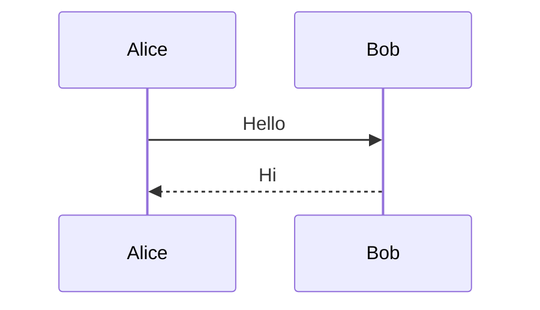
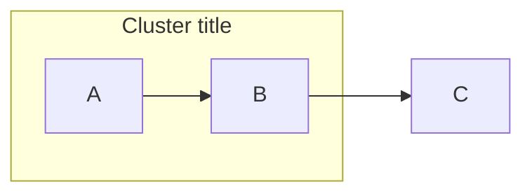
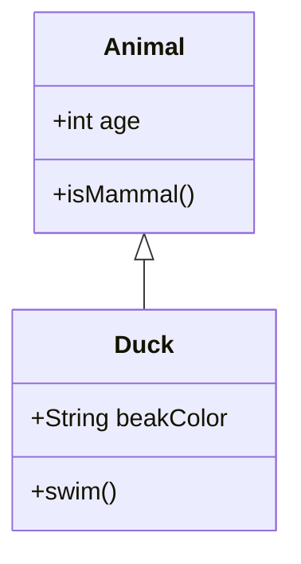
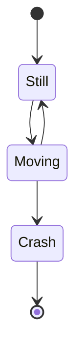
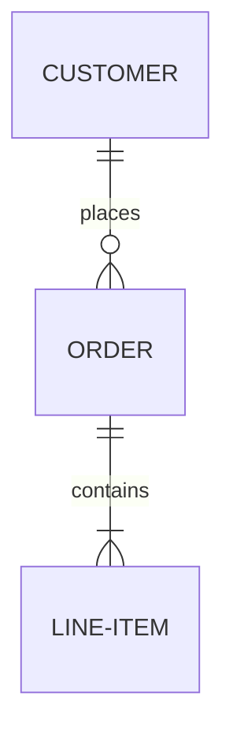
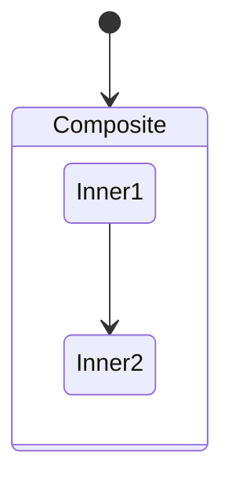

```mermaid
sequenceDiagram
  Alice->>Bob: Hello
  Bob-->>Alice: Hi
```

```mermaid
graph LR
  subgraph Cluster title
    A --> B
  end
  B --> C
```

```mermaid
classDiagram
  Animal <|-- Duck
  Animal : +int age
  Animal: +isMammal()
  class Duck{
    +String beakColor
    +swim()
  }
```

```mermaid
stateDiagram-v2
  [*] --> Still
  Still --> Moving
  Moving --> Still
  Moving --> Crash
  Crash --> [*]
```

```mermaid
erDiagram
  CUSTOMER ||--o{ ORDER : places
  ORDER ||--|{ LINE-ITEM : contains
```

```mermaid
stateDiagram-v2
  state Composite {
    Inner1 --> Inner2
  }
  [*] --> Composite
```
