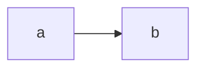

# Mermaid diagrams as a "regular" rendering feature (non-engine)

## Overview

Pivot mermaid support away from the engine model (bd-je48v /
`feature/mermaid-engine`, never merged to `main`) and implement it as:

1. **`q2 render`** (`format: html`, `format: revealjs`): a
   format-gated **AST transform** that turns ` ```mermaid ` fenced
   code blocks (`CodeBlock` with class `mermaid`) into
   `RawBlock(HTML, "<pre class=\"mermaid\">…</pre>")`, plus a
   once-per-doc CDN `<script>` injected through the canonical
   `rendered.includes.*` mechanism.
2. **`q2 preview` / hub-client** (`format: q2-preview`,
   `format: revealjs`): a **built-in React component** in
   `ts-packages/preview-renderer` that overrides the `CodeBlock`
   registry entry, renders `class="mermaid"` blocks via mermaid.js
   loaded dynamically from CDN, and delegates everything else to the
   existing built-in. This productionizes the prototype at
   `~/Desktop/daily-log/2026/07/20/mermaid-react/mermaid.tsx`.

### Why the pivot (user rationale, 2026-07-20)

- Engine execution is not ergonomic on hub-client /
  quarto-hub.com: engine outputs must be contributed via explicit
  code execution + upload to the automerge project sidecar, which
  breaks "codeless previews".
- Diagram rendering as a regular feature integrates with the new
  preview mode: the React-component prototype works today.
- Cost: the ergonomic syntax becomes ` ```mermaid ` (GFM-style)
  rather than Q1's ` ```{mermaid} `. This is arguably a net positive
  — it matches GitHub/GitLab markdown rendering conventions.

### What this supersedes

The engine implementation on `feature/mermaid-engine`
(`crates/quarto-core/src/engine/mermaid.rs`, registry/detection
edits, `RawBlock.tsx` script-execution fix, `mermaid_pipeline.rs`
integration tests) is **not merged and will not be merged**. The
branch stays as reference; the design history lives in
`claude-notes/plans/2026-05-28-mermaidjs-engine-design.md`. Note that
the engine approach's C1 hack (script inlined into
`ExecuteResult.markdown` to survive capture-splice) is unnecessary
here: with no engine there is no capture, so we can use the clean
`rendered.includes.*` path that the old plan reserved for
"after bd-cp3em".

## Syntax decision

**First cut supports only the plain fenced form:**

````

````

pampa parses this as `CodeBlock(("", ["mermaid"], []), source)` — no
engine, no cell options, works identically in native parse and WASM
parse, and renders as a code block (not broken output) on surfaces
that don't know about mermaid.

**Explicitly out of scope for the first cut** (tracked as open
questions / follow-ups, not silently dropped):

- ` ```{mermaid} ` executable-cell syntax (Q1 compat). Note the
  interaction hazard: knitr's `handledLanguages` already claims
  `mermaid`, so `{mermaid}` cells in a knitr doc get engine-routed
  today. Recognizing `{mermaid}` in the transform would create
  ambiguity about ownership. Recommendation: don't; if Q1-compat
  matters later, `qmd-syntax-helper` can rewrite the fences.
- `%%|` cell options, `fig-cap` / `label` / crossrefs-as-figures,
  `fig-width`/`fig-height`, `echo`.
- `mermaid-format: png|svg` (Q1 pre-renders via headless Chrome for
  PDF/docx — no non-HTML formats in Q2 yet).
- Theming (Q1's `--mermaid-*` CSS variables derived from Bootstrap
  SCSS, and `mermaid: theme:` metadata). See Open Questions.

## Architecture — `q2 render` path

### The transform

New file `crates/quarto-core/src/transforms/mermaid.rs`:
`MermaidRenderTransform`, an `AstTransform` with
`phase() == TransformPhase::Finalization`.

- Walk blocks; for each `CodeBlock` whose classes include `mermaid`,
  replace with `RawBlock(Format("html"), "<pre class=\"mermaid\">\n{escaped}\n</pre>")`,
  HTML-escaping `&`, `<`, `>` (same escaping the engine version used).
  Nested-in-Div cases are covered by the normal transform walk.
- If ≥1 block matched, append the CDN script to
  `ast.meta.rendered.includes.after-body` (the
  `website_favicon.rs` / `feed/link_inject.rs` precedent, consumed by
  `IncludeResolveStage`'s `write_rendered_lists` output and
  `ApplyTemplateStage`):

  ```html
  <script type="module">
  import mermaid from 'https://cdn.jsdelivr.net/npm/mermaid@11.12.0/dist/mermaid.esm.min.mjs';
  mermaid.initialize({ startOnLoad: false });
  mermaid.run({ querySelector: 'pre.mermaid' });
  </script>
  ```

  Version pinned exactly (`11.12.0`, matching Q1's bundled copy) as a
  single Rust const; the TS component pins the same version as a TS
  const. Ratified 2026-07-20.

  Explicit `mermaid.run()` rather than `startOnLoad: true`, matching
  the engine version's reasoning (robust regardless of when the
  script executes relative to DOMContentLoaded).

  **Verify at impl time**: a Finalization-phase transform runs after
  `IncludeResolveStage` has already written `rendered.includes.*` —
  confirm the favicon/feed-link transforms' exact append target and
  timing, and do the same. If late appends to
  `rendered.includes.after-body` are NOT picked up by
  `ApplyTemplateStage`, fall back to appending a trailing
  `RawBlock(HTML, script)` to the body (the engine version's shape,
  equally correct for render output).

### Pipeline placement

- In `build_transform_pipeline` (`crates/quarto-core/src/pipeline.rs`),
  Finalization phase, **immediately before `CodeBlockRenderTransform`**
  so mermaid blocks are consumed before code-block chrome
  (copy-button, highlight classes) is applied. Because the transform
  runs inside `AstTransformsStage`, `CodeHighlightStage` (a later
  stage) never sees the mermaid `CodeBlock` either.
- Gate: HTML-based targets only (`ctx.format.is_html_based()`-style
  self-gate or pipeline-level gate). It runs for **both** `html` and
  `revealjs` — it is html-family-specific, not reveal-specific, so it
  does NOT go in `reveal_finalization_transforms`.
- **Excluded from `build_q2_preview_transform_pipeline`** (the
  `Q2_PREVIEW_TRANSFORM_EXCLUDED` list): in preview the `CodeBlock`
  must survive to the React layer, which owns rendering. This
  exclusion is what makes `format: revealjs` work in both worlds —
  native render gets the RawBlock, hub-client's q2-slides preview
  gets the raw CodeBlock.
- The phase-ordering invariant test
  (`test_build_transform_pipeline_phase_ordering`) must stay green.

### revealjs specifics (native render)

Same transform, same script. Reveal slides render `pre.mermaid`
inside `<section>` elements; mermaid.run at load time processes all
of them. Known risks to check during E2E (not blockers, but must be
looked at in a browser, per Q1's special-casing):

- Diagrams on non-visible slides: mermaid measures DOM at render
  time; hidden sections can produce mis-sized SVGs. Q1 handles
  alignment/sizing in `mermaid-init.js` postProcess with
  `reveal: true`. First cut: observe behavior with mermaid@11 and
  file a follow-up strand if sizing is broken.
- Oversized diagrams overflowing slides (no `r-stretch`
  integration in the first cut).

## Architecture — preview path (React)

New built-in component in
`ts-packages/preview-renderer/src/q2-preview/blocks/MermaidCodeBlock.tsx`
(name TBD), registered in `registry.ts` **as the `CodeBlock` entry**,
wrapping the existing plain `CodeBlock.tsx`:

- If `classes.includes('mermaid')` → render `<MermaidDiagram code>`;
  else delegate to the plain built-in component (direct import, not
  via `window.__Q2_PREVIEW_RENDERER__` — that surface is for user
  TSX).
- `MermaidDiagram` is the prototype's shape: load-once cached dynamic
  `import()` of the jsdelivr ESM bundle, `mermaid.initialize({ startOnLoad: false })`,
  per-instance `mermaid.render(uniqueId, code)` → inject SVG via
  ref; error state renders the message + source instead of throwing.
  CDN lazy-load (not an npm dependency bundled like katex) is
  deliberate for the first cut, per user direction; it also keeps the
  SPA bundle small. Follow-up may vendor it.
- Because `registry.ts` is the merge base and user
  `render-components` layer on top, a user-supplied `CodeBlock`
  override still wins — the prototype workflow keeps working, and
  users can replace our mermaid handling wholesale.
- Since `format: q2-preview` and `format: revealjs` (q2-slides) both
  render through `mergedPreviewRegistry` (including inside
  `RevealDeck` slides), one component covers both — but the reveal
  path needs its own browser verification (slide visibility timing,
  see Test matrix).

Testability: structure the component so the mermaid loader is
injectable (module-level `setMermaidLoaderForTests` or similar), so
vitest can exercise dispatch + error paths without network.

### Rebuild chain (both artifacts embed this code)

- hub-client: its own Vite build bundles `preview-renderer` from
  source. Requires `npm run build:all` verification + changelog
  entries per CLAUDE.md's two-commit rule.
- `q2 preview` binary: `cargo xtask build-q2-preview-spa` then
  `cargo build --bin q2` (re-embed `q2-preview-spa/dist/`). The Rust
  transform also touches `quarto-core` → WASM leg affected → full
  `cargo xtask verify` before push.

## Work items

### Phase 0 — plan ratification + bookkeeping

- [x] Exploration: existing engine branch, Q1 implementation, preview
      renderer architecture (this session, 2026-07-20)
- [x] Plan written
- [x] User ratified plan 2026-07-20 (all five open questions resolved)
- [x] Create braid strand bd-5m4ga0s1; linked `supersedes` + `related`
      to bd-je48v; recorded in this header
- [x] Epic bd-je48v closed as superseded; `feature/mermaid-engine`
      branch kept unmerged as reference; docs strand bd-5ijtt
      re-parented to (and blocked by) bd-5m4ga0s1
- [x] Theming follow-up filed: bd-nj25kgbu (discovered-from
      bd-5m4ga0s1)

### Phase 1 — tests first (native render)

Per CLAUDE.md TDD: all of these must exist and fail before the
transform is written.

- [x] Unit tests for `MermaidRenderTransform` (in
      `transforms/mermaid.rs`, 9 tests): single block, multiple blocks
      (script appended once), rerun idempotency (sentinel), no mermaid
      block → no script + AST untouched, `{mermaid}` brace form
      untouched, HTML escaping, nested-in-Div, extra classes,
      non-HTML format no-op. **Verified failing** against the no-op
      skeleton (2026-07-20).
- [x] Integration tests via smoke-all fixtures (better vehicle than a
      bespoke integration file — three runners share them):
      `crates/quarto/tests/smoke-all/mermaid/{basic,no-mermaid,revealjs}.qmd`
      with `ensureFileRegexMatches` for the `<pre>`, escaped `--&gt;`,
      pinned CDN URL, `mermaid.run`. **Verified failing** (basic +
      revealjs fail, no-mermaid passes as expected). Note learned: a
      raw CodeBlock already renders a `<pre>` carrying class
      `mermaid`, so `ensureHtmlElements` alone is weak — the regex
      assertions carry the test.
- [x] Reveal scaffold include tests (in `revealjs/assemble.rs`, 4
      tests): header/after-body/both/absent. **Verified failing** —
      the scaffold currently drops `rendered.includes.*` entirely.
- [x] Pipeline wiring tests (in `pipeline.rs`):
      `mermaid_render_present_before_code_block_render` (html +
      revealjs) and `q2_preview_pipeline_excludes_mermaid_render`
      (q2-preview + q2-slides). **Verified failing.**

### Phase 2 — implement native render support

- [x] `MermaidRenderTransform` in
      `crates/quarto-core/src/transforms/mermaid.rs` with
      `phase() == Finalization`; `MERMAID_VERSION = "11.12.0"` const;
      5-char HTML escape; container-descending walker mirroring
      `CodeBlockRenderTransform`
- [x] Wire into `build_transform_pipeline` before
      `CodeBlockRenderTransform`; `"mermaid-render"` added to
      `Q2_PREVIEW_TRANSFORM_EXCLUDED`; phase-ordering test green
- [x] Script injection via `rendered.includes.after-body`. The
      sentinel-dedup appender was promoted from
      `attribution_viewer.rs` to a shared
      `transforms::append_with_sentinel` (single definition, both
      transforms use it)
- [x] **Discovered + fixed a general gap**: the reveal scaffold
      (`render_revealjs_document`) consumed NO includes at all —
      `rendered.includes.{header,after-body}` are now wired into the
      reveal `<head>` / before-`</body>` (`includes_block` helper).
      This is what carries `include-in-header` / `include-after-body`
      authored keys into reveal decks generally, not just mermaid.
      (`before-body` deferred — no natural anchor inside `.reveal`,
      no consumer yet.)
- [x] `cargo nextest run --workspace`: 10222 passed. clippy clean on
      quarto-core; `cargo fmt --check` clean.

#### Phase 2 end-to-end evidence (2026-07-20, per CLAUDE.md)

Invocation: `cargo run --bin q2 -- render <scratch>/demo.qmd` (html)
and `<scratch>/slides.qmd` (`format: revealjs`). Inspected output:

- `demo.html:30-32` — `<pre class="mermaid">` / `flowchart LR` /
  `a --&gt; b` (escaped); `demo.html:44-48` — single
  `<script type="module">` importing
  `https://cdn.jsdelivr.net/npm/mermaid@11.12.0/dist/mermaid.esm.min.mjs`,
  `initialize({ startOnLoad: false })`, `run({ querySelector: 'pre.mermaid' })`
  just before `</body>`; the ordinary python block still renders as
  `sourceCode python`.
- `slides.html` — `pre.mermaid` at line 24 inside the slide
  `<section>`, `Reveal.initialize` at 36, mermaid script at 57-59,
  `</body>` at 61 — after-body include correctly placed after deck
  init.

Browser-visual verification (diagram actually drawn) is Phase 4.

### Phase 3 — preview React component

- [ ] vitest tests first (in `ts-packages/preview-renderer`):
      registry dispatch (mermaid class → diagram component, other
      code → plain CodeBlock), error rendering path, loader mocked
- [ ] `MermaidCodeBlock` + `MermaidDiagram` components; registry
      entry swap in `registry.ts`
- [ ] `npm run build:all` from hub-client (strict production build)
- [ ] `cargo xtask build-q2-preview-spa` + `cargo build --bin q2`
- [ ] hub-client changelog entries (two-commit workflow)

### Phase 4 — end-to-end verification (per CLAUDE.md, record evidence here)

- [ ] `cargo run --bin q2 -- render fixture.qmd` (`format: html`) —
      inspect output HTML; open in browser; diagram renders
- [ ] `cargo run --bin q2 -- render fixture.qmd --to revealjs` —
      open in browser; diagram renders on its slide; note any
      sizing/visibility issues on later slides
- [ ] `q2 preview` (rebuilt binary): `format: q2-preview` doc with a
      mermaid block renders the diagram live; editing the block
      re-renders
- [ ] `q2 preview` / hub-client with `format: revealjs`: diagram
      renders inside `RevealDeck` slides — **explicitly called out by
      the user as needing particular testing** (slide mount/visibility
      timing differs from the flat q2-preview flow); check a diagram
      on slide 1 and on a later slide
- [ ] Prototype-compat check: the
      `~/Desktop/daily-log/2026/07/20/mermaid-react` doc (user
      `render-components` override) still works — user override
      shadows the new built-in without breaage
- [ ] Record invocations + output snippets in this file

### Phase 5 — docs + close-out

- [ ] User-facing docs page under `docs/` (syntax, both formats,
      CDN note); render with `cargo run --bin q2 -- render docs/`
      (Q2, not Q1). Relates to existing docs strand bd-5ijtt —
      re-scope or re-parent it rather than duplicating.
- [ ] Full `cargo xtask verify`; commit; ask before push

## Resolved decisions (ratified by user 2026-07-20)

1. **CDN version pinning: exact `11.12.0`** (matches Q1's bundled
   copy). Single shared constant per side — Rust const in the
   transform, TS const in the React component.
2. **bd-je48v closed as superseded**; `feature/mermaid-engine` stays
   unmerged as reference. bd-5ijtt (docs) re-parented to and blocked
   by bd-5m4ga0s1. Engine-gap follow-ups (bd-14rer, bd-s8llm,
   bd-mqk49, bd-cp3em) unaffected.
3. **Script placement: `after-body`** include (Q1 precedent).
4. **Theming deferred** — first cut renders mermaid's default theme.
   Follow-up strand filed: **bd-nj25kgbu** ("Mermaid theming:
   `--mermaid-*` CSS variables + mermaid theme metadata",
   discovered-from bd-5m4ga0s1) covering Q1's CSS-variable system
   wired into our SCSS pipeline, the `mermaid: theme:` metadata
   pass-through, and preview/render parity.
5. **`{mermaid}` cells not recognized** in the first cut; plain
   ` ```mermaid ` only.

## References

- Prototype: `~/Desktop/daily-log/2026/07/20/mermaid-react/{mermaid-react.qmd,mermaid.tsx}`
- Engine-era design (superseded): `claude-notes/plans/2026-05-28-mermaidjs-engine-design.md`
- Engine-era code (unmerged): branch `feature/mermaid-engine` —
  `crates/quarto-core/src/engine/mermaid.rs`, `tests/mermaid_pipeline.rs`
- Transform pipeline contract: `claude-notes/designs/transform-pipeline-phases.md`;
  `build_transform_pipeline` at `crates/quarto-core/src/pipeline.rs:1173`,
  Finalization seams ~1373-1400, `Q2_PREVIEW_TRANSFORM_EXCLUDED` ~1461
- Includes mechanism precedents:
  `crates/quarto-core/src/transforms/website_favicon.rs`,
  `crates/quarto-core/src/project/listing/feed/link_inject.rs:38`,
  `crates/quarto-core/src/stage/stages/include_resolve.rs`
- Preview registry: `ts-packages/preview-renderer/src/q2-preview/registry.ts:37-48`;
  built-in CodeBlock `.../blocks/CodeBlock.tsx`; iframe entry
  `.../q2-preview/entry.tsx`; merge site `PreviewRoot.tsx:1423-1426`;
  reveal path `RevealDeck.tsx`
- Quarto 1 reference: `external-sources/quarto-cli/src/core/handlers/mermaid.ts`,
  `src/resources/formats/html/mermaid/` (mermaid-init.js etc.),
  docs `external-sources/quarto-web/docs/authoring/diagrams.qmd`
