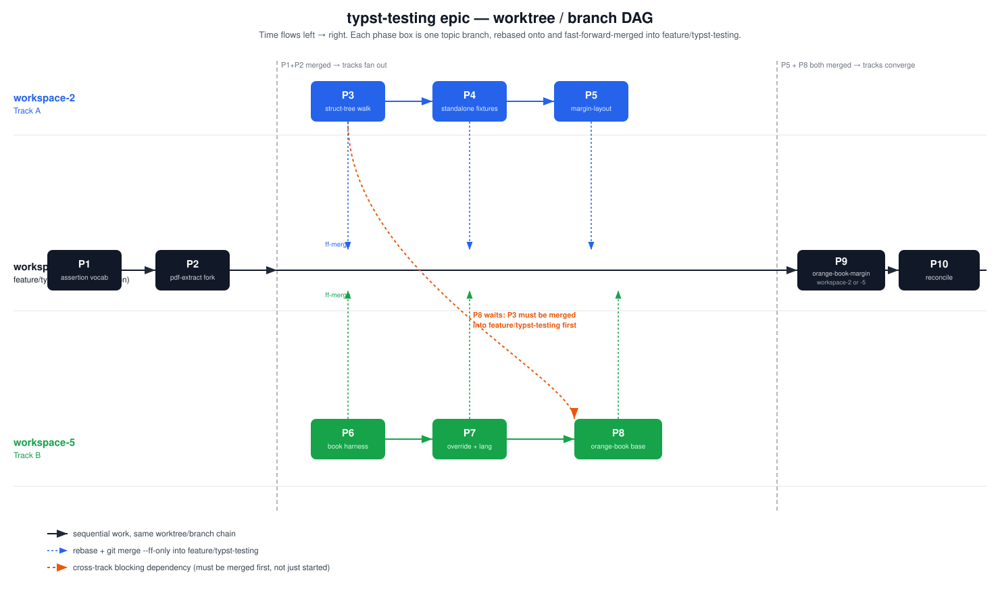

# Epic: `format: typst` smoke-all testing (orange-book port)

**Date:** 2026-09-27
**Status:** Pre-implementation. Research complete (this doc + phase docs below), all
open design questions settled with Gordon. Not yet started.
**Integration branch:** `explore/typst-smoke-all-epic` (worktree `.worktrees/workspace-3`),
branched off `main` at `e8379cfe1` — post book-projects-epic merge. Positional-predicate
research happened in parallel on `explore/typst-pdf-text-positions` (worktree
`.worktrees/workspace-4`), now folded into this epic (see P2/P3 below).
**Q1 references:** `external-sources/quarto-cli/tests/docs/smoke-all/typst/{orange-book,
orange-book-lang,orange-book-margin,override-orange-book,margin-layout,
marginalia-only-project,pdf-text-position-test.qmd}`, `tests/smoke/smoke-all.test.ts`,
`tests/verify.ts`, `tests/verify-pdf-text-position.ts`, `tests/verify-pdf-metadata.ts`.
**Design precedent:** `claude-notes/plans/2026-09-21-book-projects-epic.md` — this epic
consumes that epic's landed `ProjectKind::Book` + vendored `orange-book` subtree
(both now on `main`) as ground truth, and its P8 preview work is untouched.

## The problem

Q2's `format: typst` output has no smoke-all fixture coverage at all
(`grep -rl 'format: typst' crates/quarto/tests/smoke-all/` returns nothing). Q1's own
test suite has the deepest numbering-correctness corpus for exactly this — four
`orange-book*` book-project fixtures plus (found during research, not in the original
brief) three more fixtures in the same directory that are equally or more valuable:
a minimal standalone positional-assertion test, a minimal marginalia-only project, and
`margin-layout/` — an 86-file, non-book fixture family that is the single richest real
exercise of Q1's PDF-layout predicate in its entire test suite. This epic ports all
seven, building the assertion-vocabulary and PDF-layout-predicate infrastructure that
none of them have today.

The book-projects epic's Rust integration tests
(`book_numbering_torture.rs`, `book_appendix_letter_parity.rs`, `book_part_appendix.rs`,
`orange_book_lua.rs`, `book_numbering_lua.rs`, `book_numbering_pipeline.rs` —
1,571 lines total, all on `main`, all passing) already prove much of this numbering
correctness, but as a hand-written *reduction* of Q1's real fixtures (image-based
figures instead of knitr cells, no bibliography in at least one), never as a verbatim
smoke-all port. Gordon expected a verbatim port when the book-projects epic vendored
`orange-book`; this epic delivers it. **Decided: the two test surfaces coexist**
(Q2 below) rather than one replacing the other — see P10.

**Note on this "six" list vs. `pdf_extract` call sites**: this same six-file list is
Decision 6's mechanism-level coexistence set (P10's scope) — it is a *different*,
overlapping set from "every Rust integration test that calls `pdf_extract::extract_text`"
(P2's regression-verification scope). The full `pdf_extract` call-site grep turns up six
files, but not the same six: `book_appendix_letter_parity.rs`, `book_numbering_torture.rs`,
`book_part_appendix.rs`, and `book_numbering_pipeline.rs` appear in both lists, but
`orange_book_lua.rs`/`book_numbering_lua.rs` (in the coexistence set) call no
`pdf_extract` function at all, while `book_theorem_crossref.rs`/`book_citations.rs`
(not in the coexistence set — they test different mechanisms) do. P2's regression check
covers the `pdf_extract`-calling six; P10's cross-reference sweep covers the
coexistence six. Neither phase should assume the other's list.

## Key research findings (see phase docs for full detail + citations)

- **`ProjectKind::Book` and the vendored `orange-book` subtree are on `main`** as of
  2026-09-27 (`git log --oneline --merges main | grep book` →
  `1e7485e0b Merge commit ... as 'resources/extension-subtrees/orange-book'`). This
  epic is unblocked; it does not need to branch off or wait for anything else.
- **`margin-layout/` and `marginalia-only-project/` need none of the book-merge
  machinery** — `margin-layout/`\'s `_quarto.yml` is `project: type: website`
  (`ProjectKind::Website`, already fully handled generically in
  `crates/quarto-core/src/project/mod.rs:311-343`, no dedicated submodule needed the
  way `project/book/` exists), and every one of its 86 `.qmd` files is rendered
  independently (zero `render-project: true`, zero `run: skip` — confirmed by grep).
  `marginalia-only-project/` is `project: type: default`. Both are therefore
  *simpler* to wire up than the four `orange-book*` fixtures, which is why P5 (margin-
  layout) is scheduled before P6 (the book-project harness) becomes a hard dependency
  for P7-P9.
- **`ensurePdfTextPositions` is Rust-feasible** — confirmed by a parallel research
  thread (`typst-text-positions` session, `explore/typst-pdf-text-positions` worktree),
  which forked `pdf-extract` and added marked-content (MCID) surfacing
  (`gordonwoodhull/pdf-extract@mcid-marked-content`, commit
  `f68ca43f27b1e23d92072cc4383178a33ba25457`). **Decided: this personal fork is
  accepted as a permanent dependency for this epic** (Q1 below) — no upstream PR, no
  wait for a mirror. The harder half — walking `/StructTreeRoot` to resolve MCID→role
  — is 100% unscaffolded; that research session no longer exists, so P3 below folds
  that work into this epic directly (Q2/Q3 below) rather than treating it as an
  external prerequisite.
- **The existing assertion vocabulary already has the shape P1 needs** —
  `ensureFileRegexMatches` (`crates/quarto-test/src/spec.rs:201,343-354`) already
  implements Q1's two-array match/no-match convention; P1 is a straightforward reuse
  of that shape for Typst/PDF-specific predicates, not new design.
- **Marginalia (`marginalia` Typst package) is already vendored and wired** for
  single-document rendering (`crates/quarto-core/src/stage/stages/typst_compile.rs:123-155`,
  gated on a `.column-margin` div). Book-level margin options split into two
  mechanisms, verified during plan review: `reference-location` is confirmed
  code-verified to flow through the book-merge path (`FootnotesResolveTransform`
  runs per-chapter, before the merge point, on the same project-metadata-merged
  context every single-document render gets — not deferred past the merge the way
  citeproc is). `citation-location`/`grid.margin-width`/`grid.gutter-width` are a
  *different* mechanism — pure Pandoc template variables, not read by
  `FootnotesResolveTransform` at all — whose propagation through the book merge is
  likely fine (P8 already proves other project-level metadata reaches chapters) but
  genuinely unconfirmed until P9's spike. Recto/verso, separately, turned out to need
  no detection code at all: the real fixture's "recto"/"verso" labels are just
  comments on plain `rightOf`/`leftOf` assertions already within P3's vocabulary. See
  P9 for the full corrected write-up.

## Decided (2026-09-26/27, with Gordon)

1. **pdf-extract fork durability**: accept `gordonwoodhull/pdf-extract` (personal
   account) as a permanent dependency for this epic. No mirroring to an org account,
   no waiting on an upstream PR.
2. **Struct-tree walk ownership**: folded into this epic (P3), not spun out as a
   separate prerequisite plan.
3. **Struct-tree walk handoff**: the `typst-text-positions` research session will not
   exist when this epic executes. All context it had is captured in P2/P3's phase
   docs; nothing further to coordinate.
4. **`orange-book-margin` is in scope**, not deferred to a follow-on epic (reversing
   the original research brief's tentative P6-deferral) — resolved once
   `ensurePdfTextPositions` was confirmed Rust-feasible.
5. **`ensurePdfTextPositions` scope: full predicate support** (`role`, `granularity`,
   page-scoping, all relations), not the reduced "just the base fixture's one
   assertion" scope floated during research.
6. **Coexist, not replace**: the six existing Rust book integration tests stay
   (mechanism-level regression guards); the new smoke-all fixtures become the
   end-to-end, foreign-extension-fidelity source of truth. Applies to all six files,
   including the two the original brief didn't name
   (`book_numbering_lua.rs`, `book_numbering_pipeline.rs`).
7. **New fixtures beyond the original four-fixture brief are in scope**:
   `pdf-text-position-test.qmd`, `marginalia-only-project`, and `margin-layout`
   (86 files) — found during research, all cheaper to port than `orange-book*` and
   collectively a better proving ground for the position predicate.
8. **`margin-layout` is sequenced before `orange-book-margin`** so the struct-tree
   implementation gets battle-tested against 76 real assertions before being trusted
   on the book-context fixture (Gordon confirmed this ordering is correct).

## Phases

| Phase | Scope | Depends on | Novel vs. port |
|---|---|---|---|
| **P1** | Assertion vocabulary: `ensureTypstFileRegexMatches` + `ensurePdfRegexMatches` in `quarto-test` | — | Port (reuses existing two-array shape) |
| **P2** | Pin `pdf-extract` fork by commit rev; verify no 0.7→0.12+ regression against the six existing Rust book tests | — (parallel with P1) | Mechanical + verification |
| **P3** | `ensurePdfTextPositions`: `/StructTreeRoot` walk (MCID→role resolution) + relational-assertion evaluator | P1, P2 | **Genuinely new — the epic's real risk center** |
| **P4** | Standalone validation fixtures: `pdf-text-position-test.qmd` + `marginalia-only-project` | P1, P3 | Port (cheap, proves the DSL) |
| **P5** | `margin-layout` port (86 files, website-type project, no book dependency) | P1, P3, P4 | Port (large, but mechanically uniform) |
| **P6** | Book-project-fixture harness: project-root detection, `render-project: true` dedup, `render_project_document()` wiring `ProjectPipeline::run_with_book_support()` | P1 | Genuinely new (harness) — **its headline risk dissolved on inspection; now a straightforward wiring task** |
| **P7** | Port `override-orange-book` + `orange-book-lang` | P1, P6 | Port |
| **P8** | Port `orange-book` base, full predicates | P1, P3, P6, P7 | Port |
| **P9** | Port `orange-book-margin` (book-context margin notes: chapter-relative, recto/verso) | P5, P8 | Port + one confirming spike |
| **P10** | Reconcile/coexist with the six existing Rust book integration tests | P8, P9 | Docs/analysis, no code |

**Renumbering note:** early research-round chat used ad hoc labels (P0a/P0/P0b/P0c);
this table is the authoritative phase list and supersedes those labels.

**Risk-weighting note (added after a holistic plan-review pass):** P3 and P6 were
both originally labeled "Genuinely new," implying comparable effort — that stopped
being true across four rounds of review. P6's headline open question (whether an
internal function needed a visibility change) turned out to be resolvable by reading
code, and P6 is now a straightforward wiring task with one small, already-identified
gap. P3, meanwhile, grew into a from-scratch tagged-PDF structure-tree walker and
8-relation geometry evaluator — page-scoped `(PageRef, Mcid)` keying, text-search
selector resolution with ambiguity handling, page-scoped `granularity` aggregation,
and a same-page comparison guard, all built to semantically match a mature
`pdf.js`-based reference implementation, validated so far by one manual spike and
planned synthetic unit tests before being trusted against ~76 real assertions in P5
and ~24 in P9. Treat P3 as the epic's actual center of gravity when planning
implementation order, review depth, or time estimates — not a peer of P6.

## Parallel development plan (three worktrees)

This epic is implemented across three existing worktrees, following Gordon's
preferred integration pattern: a long-lived integration branch, each phase done on
its own topic branch, **rebased onto the integration branch's current tip and then
fast-forward-merged in** when done (not `--no-ff` — this deliberately differs from
`.claude/rules/worktrees.md`\'s general braid-strand convention, because this epic
isn't braid-tracked; Gordon's instruction for this specific epic wins).



**Worktree → track assignment:**

| Worktree | Absolute path | Role |
|---|---|---|
| `workspace-3` | `/Users/gordon/src/q2/.worktrees/workspace-3` | Hosts `feature/typst-testing` (the integration branch). Also does the two small bootstrap phases (P1, P2) directly, before the tracks fan out. |
| `workspace-2` | `/Users/gordon/src/q2/.worktrees/workspace-2` | Track A: P3 → P4 → P5 |
| `workspace-5` | `/Users/gordon/src/q2/.worktrees/workspace-5` | Track B: P6 → P7 → P8 |

`workspace-2` currently sits on `feature/book-projects` (fully merged into `main`,
safe to branch away from). `workspace-5` currently sits on `plan7c-ipynb` (already
landed on `main` under different commit hashes via rebase/cherry-pick, confirmed by
matching commit messages — also safe to branch away from). Switching branches in a
worktree never deletes anything; both old branches remain reachable by name if
ever needed again.

**The one cross-track blocking dependency**: P8 (Track B) also depends on P3 (Track
A) — it is not two fully independent tracks. Whoever is about to start P8 must
confirm P3 has actually been *merged* into `feature/typst-testing` (not just
started) before branching. See P8's own doc for the exact check.

**The convergence point**: P9 needs both P5 (Track A's last phase) and P8 (Track
B's last phase) merged. Whichever worktree finishes its track first picks up P9 once
both are confirmed merged, then continues directly to P10 (which needs P8 and P9 —
already implied once P9 is done).

### One-time bootstrap (run once, before P1 starts)

```bash
cd /Users/gordon/src/q2/.worktrees/workspace-3
# Only if feature/typst-testing doesn't already exist:
git rev-parse --verify feature/typst-testing 2>/dev/null || \
  git checkout -b feature/typst-testing explore/typst-smoke-all-epic
git checkout feature/typst-testing   # if it already existed
```

### The generic per-phase recipe

Every phase doc below has its own copy of these commands with the phase's actual
worktree, branch name, and preconditions filled in — this section is the shared
rationale, not something you need to cross-reference to execute a phase.

1. **Sync and branch** (in the phase's assigned worktree): create/reset a topic
   branch `typst-testing/pN-<slug>` off `feature/typst-testing`\'s current tip.
   `feature/typst-testing` is a local ref shared across all worktrees in this repo
   (they're the same `.git`) — no `git fetch` needed to see it, even though it's
   checked out in `workspace-3`.
2. **Implement** the phase's checklist, gating each task on
   `cargo clippy -p <crate> --all-targets -- -D warnings` + `cargo nextest run -p
   <crate>` per the standard per-task gate.
3. **Close out the phase doc**: flip every `- [ ]` to `- [x]` in the checklist
   (only if actually done — don't rubber-stamp), and change the `## Status` section
   from `Not started.` to `Complete.` (this exact string — other phases\' "is this
   merged yet" checks grep for it). Commit this with the implementation.
4. **Re-sync before merging**: rebase the topic branch onto
   `feature/typst-testing`\'s *current* tip again (something may have merged from the
   other track while you worked). Resolve conflicts and re-run the gate if anything
   moved.
5. **Merge** (must happen in `workspace-3`, the only worktree with
   `feature/typst-testing` checked out):
   ```bash
   cd /Users/gordon/src/q2/.worktrees/workspace-3
   git merge --ff-only typst-testing/pN-<slug>
   ```
   If this fails (someone else merged in the meantime, so it's no longer a strict
   fast-forward), go back to step 4 — rebase onto the new tip and retry. Don't
   force-push or resolve this any other way.
6. **Phase-boundary gate**: still in `workspace-3`, run
   `cargo nextest run --workspace` once (~3 min) and report its delta against the
   last known baseline — this is the one place drift between the two tracks would
   surface. Push if you push this branch anywhere:
   `git push origin feature/typst-testing`.
7. Optionally delete the merged topic branch (`git branch -d
   typst-testing/pN-<slug>`) — harmless to leave it too.

### Checking whether a prerequisite phase has merged (used by P8, P9, P10)

```bash
cd /Users/gordon/src/q2/.worktrees/workspace-3
git show feature/typst-testing:claude-notes/plans/2026-09-27-typst-smoke-all-epic-P<N>-<slug>.md \
  | grep -q '^Complete\.' && echo "P<N> merged — proceed" || echo "P<N> not yet merged — wait, re-check later"
```

## Definition of done

- All seven fixtures (`pdf-text-position-test`, `marginalia-only-project`,
  `margin-layout`, `override-orange-book`, `orange-book-lang`, `orange-book`,
  `orange-book-margin`) render and pass their full, unreduced assertion sets under
  Q2's smoke-all harness, using Q1's fixtures verbatim (no assertion rewriting beyond
  syntax translation into Q2's spec DSL) — **with one explicit escape hatch, added
  after a holistic review caught this contradicting P5's own checklist**: P5's
  86-file `margin-layout` triage step explicitly allows filing a failure as "(b) a
  real Q2 Typst rendering gap — out of this epic's scope" rather than requiring this
  epic to fix every pre-existing Q2 rendering bug the port happens to surface. If
  that triage path is used for any file, "done" means every fixture passes *except*
  assertions covering a specifically identified, separately-filed rendering gap —
  not literally zero failures. Track the count if this happens (e.g. "84/86 pass,
  2 filed as bd-XXXX/bd-YYYY") rather than silently redefining "pass."
- `ensurePdfTextPositions` supports `role`, `granularity`, page-scoping, and all
  8 relations Q1's predicate supports (`leftAligned`, `rightAligned`, `topAligned`,
  `bottomAligned`, `rightOf`, `leftOf`, `above`, `below` — an earlier draft of this
  doc omitted `bottomAligned`, an oversight caught during implementability review,
  not a deliberate cut), backed by real `/StructTreeRoot` MCID resolution, not a
  text-only approximation.
- The six existing Rust book integration tests still pass, unmodified in intent
  (mechanism-level coverage), documented as the deliberate coexistence with the new
  smoke-all fixtures (P10).
- `pdf-extract` fork dependency is pinned by commit SHA (not branch), and its adoption
  is verified not to regress the six existing Rust tests\' behavior.

### P10 confirmation (2026-09-29): both surfaces green in the same workspace run

`cargo nextest run --workspace --no-fail-fast` at `feature/typst-testing` HEAD
(workspace-2, macOS): **15295 tests run, 15294 passed, 1 failed, 201 skipped**,
718.929s. The one failure is `quarto::integration smoke_all::smoke_all` itself
(232 passed, 45 skipped, 1 failed *within* that test) — the pre-existing,
separately-filed bd-gak8uiza `{}`-unimplemented gap in
`orange-book-margin/index.qmd` (missing `fig-visualization` crossref/caption),
not a new regression. Per this doc's own escape hatch above, "done" here means
every fixture passes except that one identified, filed gap — not literally
zero failures.

**Delta against the current live baseline** (`main` @ `e8379cfe1`, CI run
36479624208, `macos-latest` job, 2026-09-28): 15188 tests run, 15188 passed
(0 failed), 201 skipped, 391.512s. So: **+107 tests, 0→1 failed (the accepted
gap above), skip count unchanged.** The six existing Rust book-numbering
tests (P10's own scope) are part of that unchanged-pass set — confirmed
individually via the per-crate `-p quarto-core` gate, not just inferred from
the workspace total.

**Wall-clock**: 718.929s (this branch, local macOS) vs. 391.512s (`main`,
CI `macos-latest`) — a ~84% increase, **not proportional to the +107 test
count** (+0.7%). The increase is overwhelmingly `smoke_all` itself getting
heavier (162.5s of the total, up from a lighter pre-epic baseline), from
compiling ~90 additional real Typst/PDF fixtures inside that one test, not
from more discrete tests. Accepted as the inherent cost of real end-to-end
PDF-rendering coverage — see "Known limitations" and P3's checklist for the
Typst-version compatibility spike this same session also closed out
(CI's pinned Typst 0.15.1 produces no struct-tree-shape regression vs. the
0.14.2 used for local development).

## Pre-epic spikes (both completed 2026-09-27, before any phase starts)

Two items surfaced by implementability review were resolved empirically before
implementation begins, rather than left as first-checklist-item unknowns:

1. **`external-sources/quarto-cli` availability** — resolved by recreating a
   symlink, not a design question. See below.
2. **`pdf-extract` 0.7→0.12+ upgrade drift** — a spike (two throwaway binaries, one
   per version, run against 5 real Typst-produced PDFs including the dense
   multi-chapter `orange-book` book PDF) found byte-for-byte identical
   `extract_text()` output on all 5. See P2 for the full write-up. Substantially
   de-risks, but doesn't replace, P2's own `cargo nextest run -p quarto-core`
   regression gate against the actual six test fixtures.

## Resolved: `external-sources/quarto-cli` availability

All three implementability reviewers independently hit this and flagged it as a
blocker: `external-sources/quarto-cli` was absent from this epic's own worktree
(`.worktrees/workspace-3` only had `commonmark-spec`). Turned out to be a one-line
setup gap, not a design question — in the main repo, `external-sources/quarto-cli`
(along with `pandoc`, `automerge`, `rmarkdown`, `samod`, `tinytex`) is a **symlink**
to Gordon's own sibling checkout (`/Users/gordon/src/quarto-cli`), entirely outside
the q2 repo and `.gitignore`d (`.gitignore:6-7`) — `git worktree add` never
populates gitignored content, so a fresh worktree just needs the same symlink
recreated: `ln -s /Users/gordon/src/quarto-cli external-sources/quarto-cli`. Already
done for this worktree (confirmed resolving to the real fixture tree). Not written
into any plan-file checklist since it's environment setup, not epic scope — worth
a one-line mention in `worktrees.md`\'s fresh-worktree-bootstrap section if this
recurs for other epics, but that's a call for whoever owns that doc, not this one.

## Note on fixture directory placement

Every phase's "copy into `crates/quarto/tests/smoke-all/typst/<name>/`" instruction
is a human-organization convention only. `smoke_all.rs`\'s discovery walks the whole
`tests/smoke-all/` tree recursively, filtering purely on `.qmd` extension — no
directory-structure logic exists, and today's tree doesn't even have a `typst/`
subdirectory (fixtures are organized by topic, e.g. `appendix/`, `extensions/`).
Placement doesn't affect whether a phase's fixtures run; it's there so a human
scanning the directory can find all Typst fixtures together.

## Known limitations (anticipated; confirm/revise per-phase)

- **`ensurePdfMetadata`** (title/author/keywords) is not built — not used by any of
  the seven fixtures in scope. Add if a future fixture needs it.
- **The `pdf-extract` dependency is a personal-account git fork**, pinned by commit
  SHA. If `gordonwoodhull/pdf-extract` disappears or the account becomes unreachable,
  this epic's PDF-position testing breaks until re-pointed. Accepted per Decision 1
  above; revisit if it becomes a real problem.
- **Page-level `/StructTreeRoot` scoping is confirmed subtle, and verified against a
  real render** (spike done during plan review, not deferred to P3 start): any
  StructElem — not just `/Sect`-like containers — can span multiple pages (observed
  directly: a plain `/P` element's kids split across a page break in a
  `typst compile`-produced tagged PDF). More importantly, **MCIDs are only unique
  per page, not document-wide** — page 2 restarts numbering at 0 just like page 1.
  Q1 never hits this: `pdf.js`\'s `page.getStructTree()` hands back an
  already-page-scoped tree per page, and its own marked-content identifiers are
  page-qualified strings (e.g. `"p2R_mc0"`), not bare integers — so cross-page MCID
  collision and cross-page `granularity` aggregation are both structurally
  impossible in Q1's implementation, not explicitly guarded against. A `lopdf`-based
  walker gets no such scoping for free: `/StructTreeRoot` is one document-wide tree.
  P3 must therefore (a) key its MCID map by `(PageRef, Mcid)`, not `Mcid` alone, and
  (b) explicitly scope `granularity` bbox aggregation to the resolved item's own
  page (mirroring what Q1's per-page struct tree gives it implicitly) rather than
  unioning bboxes across whatever pages an ancestor's descendants happen to land on.
  See P3 for the full corrected write-up and
  `claude-notes/research/2026-09-27-typst-tagged-pdf-struct-tree.md` for the spike's
  raw findings (fixture, tool, exact struct-tree dump).

## References

- Book-projects epic (consumed, not modified): `claude-notes/plans/2026-09-21-book-projects-epic.md`
- Book-projects design doc (authoritative background for the book-merge machinery
  P6/P8/P9 build on): `claude-notes/designs/book-projects-architecture.md`
- Struct-tree spike raw findings (fixture, tool, exact dump — not needed inline in
  P3, kept here for reproducibility):
  `claude-notes/research/2026-09-27-typst-tagged-pdf-struct-tree.md`
- Q1 predicates: `external-sources/quarto-cli/tests/verify.ts:814` (`ensureTypstFileRegexMatches`),
  `:835` (`ensurePdfRegexMatches`); `external-sources/quarto-cli/tests/verify-pdf-text-position.ts`
  (`ensurePdfTextPositions`); `external-sources/quarto-cli/tests/smoke/smoke-all.test.ts:443-455`
  (`render-project: true` semantics)
- `pdf-extract` fork: `https://github.com/gordonwoodhull/pdf-extract`, branch
  `mcid-marked-content`, commit `f68ca43f27b1e23d92072cc4383178a33ba25457`
