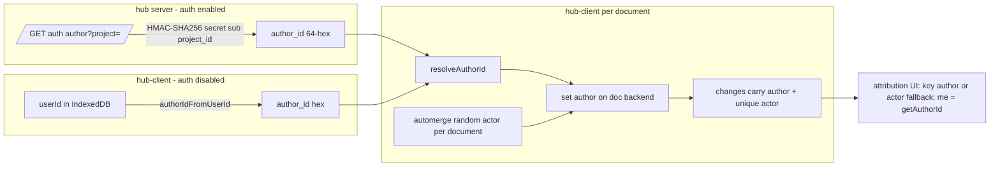

# Plan: Transition quarto-hub from stable actor IDs to automerge author IDs

Date: 2026-09-30
Status: Approved — in execution. Gordon's go-ahead given 2026-09-30,
lifting the gate bd-6f21d4c6 sets ("No production fix without Gordon's
go-ahead"). Execution epic bd-o1yn1fqy; phase strands bd-c0y8i71s (P0),
bd-kmycto1p (P1), bd-x3b1e0t9 (P2), bd-u3cbfv3g (P3), bd-7jdb6mnp (P4),
bd-r62zad5b (P5), each linked `discovered-from` bd-6f21d4c6.

## Overview

Automerge 3.5.0 (JS, 2026-09-16) / automerge 0.12.0 (Rust, 2026-09-16) shipped a
**change-level author metadata** feature: every change can carry an opaque
hex-string "author" in its metadata, recorded in the document history and
propagated by sync. See [the 3.5.0 release notes](https://github.com/automerge/automerge/releases/tag/js%2Fautomerge-3.5.0),
[`Author` in the Rust API](https://docs.rs/automerge/latest/automerge/struct.Author.html),
and the design-intent note in [This Month in Automerge: July '26](https://automerge.org/blog/2026-july/)
("author provenance").

Quarto-hub currently solves attribution by giving each user a **stable actor
ID** and reusing it for every change, on every device and tab:

- **Authenticated deployments (OIDC):** the hub mints
  `HMAC-SHA256(server_secret, sub || "\0" || project_id)` and serves it from
  `GET /auth/actor`.
- **Auth-disabled deployments** (local-prod / `--allow-insecure-auth`): the
  client derives one from its IndexedDB `userId` (`actorIdFromUserId`).

This conflates two things automerge now separates:

- **Actor ID** — a CRDT-mechanics identifier. Each actor's changes must be
  strictly sequential. Reusing one actor across concurrent sessions is not a
  theoretical hazard: it is the root cause of the production duplicate-seq
  wedge in bd-6f21d4c6 (`RangeError: duplicate seq N found for actor`), which
  the 2026-09-17 self-heal plan worked around but explicitly left unfixed
  ("needs a change to `actorIdFromUserId` … tracked as future work"). A shared
  actor also makes the sync client's local-vs-remote change classification
  (`client.ts:627`, compares against the doc's own actor) misfile another
  tab's edit by the same user as local.
- **Author ID** — pure attribution metadata. Free-form, stable, per-user,
  carried inside each change, with first-class query APIs.

This plan transitions **all deployments** so that:

1. **Author IDs** carry the stable per-user identity: server-minted HMAC in
   authenticated deployments (same construction as today — the output is
   already a valid author hex string), locally derived from `userId` in
   auth-disabled deployments (same value `actorIdFromUserId` produces today).
2. **Actor IDs** return to the upstream-recommended role: automerge's random
   actor per document instance, never chosen by our code, never shared.
3. All attribution consumers — history readers *and* the "current user"
   checks — key off `change.author`, falling back to `change.actor` for
   pre-transition history (which has `author: null`).

Scope: hub server endpoint, quarto-sync-client, the preview-runtime wrapper,
hub-client (open paths, local branches, attribution UI), and the
preview-renderer current-user plumbing. Server-side writes and quarto-hub-mcp
are audited in Phase 5.

## Current state inventory (re-verified 2026-09-30)

Dependency versions already in the tree — **no dependency bump needed**:

- `@automerge/automerge` 3.5.0 installed (`node_modules`), `^3.5.0` in
  `hub-client/package.json` and `ts-packages/quarto-sync-client/package.json`.
- `@automerge/automerge-repo` 2.6.0-alpha.5 — **no author support in its API**
  (grep of `dist/*.d.ts` finds nothing); author must be applied below the repo
  layer, same pattern as `applyActorId` uses today.
- `automerge = 0.12.0` (with `utf16-indexing`) in
  `crates/quarto-hub/Cargo.toml:48`.

Stable-actor-ID sites:

| Site | File:line | Role |
|---|---|---|
| HMAC minting | `crates/quarto-hub/src/auth.rs:751` (`sub_to_actor_id_for_project`) | Derives 64-hex per-project ID |
| HTTP endpoint | `crates/quarto-hub/src/server.rs:1313` (`auth_actor`), route at `:1758` | `GET /auth/actor?project=` |
| Client fetch | `hub-client/src/services/authService.ts:79-120` (`fetchActorId`, `resolveActorId`) | Three-valued contract: string / undefined (auth off) / null (auth failure) |
| App wiring | `hub-client/src/App.tsx:142,201,310` | `localActorId` state (from `actorIdFromUserId`), `resolveActorId` callback used by the four open paths (`:413, :616, :711, :850`) |
| E2E override | `hub-client/src/App.tsx:77-114` (`__QUARTO_TEST_ACTOR_ID__`) | Read by `hub-client/e2e/q2-preview-render-components-{comment,kanban,drag}.spec.ts` so `getActorId()` is stable and known inside the preview iframe |
| Doc application | `ts-packages/quarto-sync-client/src/client.ts:688-691` (`applyActorId`), `:699-710` (`createDoc`), `:732` (`findDoc`, also covers the self-heal re-fetch) | `automergeClone(doc, { actor })` / `automergeFrom(init, { actor })` |
| Client state | `client.ts:1180` (`connect`), `:2025-2188` (`createNewProject`, via the `resolveActorId` callback parameter), `:2229` (`getActorId`) | `state.actorId` — the single "my actor" the client assumes today |
| preview-runtime wrapper | `ts-packages/preview-runtime/src/automergeSync.ts:166` (`connect`), `:312-317` (`createNewProject`, `resolveActorId`), `:323` (`getActorId`) | Pass-through API used by hub-client and the q2 preview SPA |
| Identity map | `ts-packages/quarto-automerge-schema/src/index.ts:66` (`identities?: Record<string, ActorIdentity>`), written via `setIdentity` at `client.ts:1264, 2094` | actorId → {name, color} for attribution UI |
| Local fallback | `hub-client/src/services/userSettings.ts:32-40` (`actorIdFromUserId`) | Auth-disabled only — stable actor from IndexedDB `userId` |
| **Current-user key** | `getActorId()` → `components/render/ReactPreview.tsx:906` (`currentActor`) → `Q2SandboxedPreviewIframe.tsx` → `ts-packages/preview-renderer/src/framework/CurrentActorContext.tsx` (`useCurrentActor()`, `actor === me` checks in user TSX: comments, kanban, drag); `hub-client/src/components/ReplayDrawer.tsx:357,520` (`--me` highlight); `DevHarness.tsx:487` (comment) | How the UI knows which changes are *mine* |
| Replay attribution producer | `hub-client/src/services/attribution-runs.ts:269-285` (`replayChange`) | Replays history, stamps each attribution run with `decodeChange(change).actor` |
| Replay step metadata | `ts-packages/quarto-sync-client/src/replay.ts:75-84`; `ReplayDrawer.tsx` | Per-history-step `{ timestamp, actor }` shown in the replay drawer |
| Attribution wire | `hub-client/src/hooks/useAttribution.ts` builds `{ runs, identities }` keyed by `AttributionRun.actor`; Rust side `TransportAttributionRun.actor` / `identities: HashMap<String, Identity>` (`crates/quarto-core/src/attribution/types.rs:158-177`) via `PreBuiltAttributionProvider` | JS producer chooses the key; Rust only joins on it |
| Local branches | `hub-client/src/services/branchService.ts:133` (`A.load`), `:208` (`A.clone(sourceDoc)`) | Branch docs are edited through the ordinary change path and `A.merge`d back to main |
| Project-set docs | `hub-client/src/services/projectSetService.ts:595` (`automergeFrom(initial)`) | Created without an actor; no attribution UI |
| Duplicate-seq self-heal | `client.ts:740-880` (`installDuplicateSeqRecovery`, `recoverIndexDocument`, bd-6f21d4c6) | Workaround for the collision this plan removes at the source |

Deliberately **not** actor-keyed (no change needed): presence/cursors use
ephemeral `peerId` (`hub-client/src/hooks/usePresence.ts`); the execution
beacon's `actorId: 'exec-1'` is channel-message identity for q2 executor
processes, not document attribution; `hub-client/src/utils/facepile.ts`,
`ProjectsHome.tsx:1100` (contributors) and `Editor.tsx:902` (mention list)
read identity *values* (name/color) only, never keys.

Not writers: `quarto-preview` and `quarto-hub-provider` link automerge but
never `transact`. Hub server writes live in `index.rs` and `sync.rs` (Phase 5).
`quarto-hub-mcp` connects with `actorId` undefined
(`connection-manager.ts:299`), so bot edits already carry a random actor and
no identity.

## Verified author-ID API surface

JS (`@automerge/automerge` 3.5.0, from installed `dist/*.d.ts` and
`dist/mjs/implementation.js`):

- `InitOptions { actor?, author?, ... }` — accepted by `init`/`load`/`from`/
  `clone`, but **only `init` and `clone` honor `author`**
  (`handle.setAuthor(opts.author)` at `implementation.js:107, 161`); `from`
  delegates to `init`, so it inherits the handling. **`load` drops `author`
  silently** unless a `patchCallback` is also passed (that path routes through
  `init(opts)`); the plain path is `ApiHandler.load(data, { actor, ... })`
  with no `setAuthor` call. After a plain `load`, apply the author via
  `clone(loaded, { author })` or the escape hatch below.
- `clone` is `handle.fork(opts.actor, heads)` followed by `setAuthor`; with
  `actor` omitted, `fork` generates a fresh random actor **per call**.
- `getAuthor(doc): Author | null` — the doc's currently-set author.
- `getAuthors(doc): Author[]` — all authors appearing in history.
- `getAuthorForActor(doc, actor): Author | null`,
  `getActorsForAuthor(doc, author): ActorId[]` — mapping derived from history.
- `DecodedChange.author` / `ChangeMetadata.author`: `Author | null` — **null
  for all pre-3.5 changes**, which is what makes this a purely additive
  migration (no document rewrite).
- `Author = string`, an opaque **hex** string.
- **Wire encoding (identical in JS and Rust — same Rust core):** the author
  is a footer in the change's existing `extra_bytes` field
  (`0x01 | leb128(len) | author bytes`, `change.rs:367-403`), not a new
  column. Old decoders store and relay `extra_bytes` uninterpreted, so
  pre-3.5 / pre-0.12 clients decode and re-sync author-stamped changes
  without error. Two corollaries: a change carries an author **or** user
  `extraBytes`, never both (`Transaction::extra_bytes()` returns only the
  author footer) — nothing in the tree writes `extraBytes`, so this costs us
  nothing; and our pre-transition changes all have empty `extra_bytes`, hence
  decode as `author: null` with no risk of a legacy footer misparsing as an
  author.
- Escape hatch: `getBackend(doc).setAuthor(author)` (`wasm_types.d.ts:458`).
- automerge-repo paths that (re)create a doc do so **without options**:
  `Repo.import` → `Automerge.load(binary)` (`Repo.js:500`); storage load →
  `A.loadIncremental(A.init(), binary)` (`storage/StorageSubsystem.js:139`). So the
  author, like the actor today, must be applied after the handle is ready —
  via `getBackend(handle.docSync()).setAuthor(author)` (the escape hatch
  above; D9), with `handle.update(doc => clone(doc, { author }))` as the
  documented fallback. Sync receive
  (`A.receiveSyncMessage`) and `handle.change` (`A.change`) operate on the
  same backend and preserve it.
- **Read paths need no automerge-repo changes**: `DocHandle.metadata()` is a
  wholesale `A.inspectChange()` passthrough (`DocHandle.js:292`), so `author`
  is present at runtime — only the narrow local `ViewableHandle` types in
  `attribution-runs.ts` and `replay.ts` need widening.

Rust (`automerge` 0.12.0, from the registry source):

- `Author<'a>(Cow<'a, [u8]>)` — `From<Vec<u8>>`/`&[u8]`, `FromStr` (hex
  decode → `InvalidAuthor`), `to_hex_string()`, serde impls.
- `LoadOptions::author(Author<'static>)` (`automerge.rs:166`);
  `Automerge::with_author` / `set_author` / `get_author` / `get_authors` /
  `get_author_for_actor` (`automerge.rs:376-414`); `AutoCommit::with_author` /
  `set_author` / `get_author` (`autocommit.rs:401-429`); `Change::author()`
  (`change.rs:48`).

## Target design

- Server mints the author ID with the **same HMAC construction** as today
  (same pseudonymity properties: per-project isolation, server-secret binding).
  Authors are free-form bytes rendered as hex, and the HMAC output is already
  64-hex — valid with no re-encoding. The minted value is therefore
  **byte-for-byte identical** to the actor ID that user would previously have
  received for the project; only its role changes (served from `/auth/author`,
  applied via `{ author }` instead of `{ actor }`).
- Auth-disabled deployments derive the author locally with the same
  derivation `actorIdFromUserId` uses today (renamed `authorIdFromUserId`), so
  the local author equals the stable actor that user had.
- No code chooses actors anymore. Each document instance gets automerge's
  default random actor (from `fork`/`init`). This removes the root cause of
  bd-6f21d4c6 in every deployment mode.
- `identities` in the IndexDocument becomes keyed by **author ID**; readers
  resolve `change.author ?? change.actor` so pre-transition history keeps its
  attribution. Because the author ID equals the old actor ID, a user's
  identity-map key **does not change across the transition**: legacy changes
  (fallback to `change.actor`) and new changes (`change.author`) resolve to
  the same key, so attribution is continuous with no aliasing or re-keying
  migration.
- The **current-user key** is `getAuthorId()`, which replaces `getActorId()`
  everywhere "me" is computed. Downstream prop and field names
  (`currentActor`, `CurrentActorContext`, `data-attr-actor`,
  `AttributionRun.actor`, `TransportAttributionRun.actor`) keep their names and
  are documented as carrying the *attribution key* (author, or actor for
  legacy changes).

## Decisions

- **D1 — Actor model.** Automerge default: random per document instance.
  Per-tab or persisted per-device actors are rejected — a per-device actor
  is shared by every tab on that device, which is exactly the bd-6f21d4c6
  collision.
- **D2 — Auth-disabled parity.** In scope. Auth-disabled deployments move to
  random actor + locally derived author. The production collision was
  observed in this mode; leaving it on a stable actor would preserve the
  known root cause.
- **D3 — Endpoint shape.** New `GET /auth/author`. `/auth/actor` stays,
  deprecated, and is removed in a follow-up strand once no released client
  calls it.
- **D4 — identities keying.** Re-key by author with actor fallback (additive,
  same map). No parallel `authorIdentities` map.
- **D5 — Derivation continuity.** `author_id == legacy actor_id`. Gives
  continuous attribution keys and a clean version-skew story: an old client
  emitting the stable actor and a new client emitting the same value as
  author resolve to one identity with no aliasing. A domain-separated HMAC
  would cost two identity entries per user plus aliasing logic in readers.
- **D6 — Wire and prop naming.** Keep the `actor` field/prop names in
  `AttributionRun`, `TransportAttributionRun`, `data-attr-actor`,
  `currentActor`. Document them as "attribution key". No end-to-end rename;
  the Rust side needs no code change.
- **D7 — Explicit-actor plumbing.** Removed rather than kept alongside. The
  `actorId` parameters of `connect`/`createNewProject` become `authorId`,
  `state.actorId` becomes `state.authorId`, `getActorId()` becomes
  `getAuthorId()`, and the e2e override becomes `__QUARTO_TEST_AUTHOR_ID__`.
- **D8 — Authorless where there is no author.** Writes that do not originate
  from a signed-in or locally identified user carry no author: hub-server
  writes (files map, capture sidecar, filesystem import), project-set
  documents, and any client path where `resolveAuthorId` yields `undefined`.
  No synthetic "hub" or "system" author. Readers already handle
  `author: null` via the actor fallback, so these show up exactly as legacy
  changes do.
- **D9 — Author application mechanism.** Set the author in place via
  `getBackend(doc).setAuthor(author)` on the repo handle's doc, not via
  `handle.update(doc => clone(doc, { author }))`. Author is runtime-only
  backend state (never serialized), so in-place mutation is semantically
  correct and avoids the clone's side effects: a full-document fork per
  `findDoc`, a re-randomized actor on every call (one random actor per
  document instance is D1's model, not one per find), a spurious
  `applyMutation` notification through the repo, and `DocHandle.update`'s
  fixed-heads precondition. The backend is shared by construction:
  `fork`/`clone` are the only ways to get a second backend (`view` reuses
  the same handle), and on the paths our handles flow through — find,
  `Repo.import`, storage load, sync receive — the repo never forks (its
  internal clones are confined to `Repo.clone` and a `DocHandle` diff
  helper, which our handles never pass through). The mutation therefore
  sticks for every later `handle.change`.
  `getBackend` is a `/** @hidden */` export (stable in practice since
  pre-3.x); if it is ever removed the failure is loud at doc-open and caught
  by the Phase 0 spike and CI, and the clone form is the documented one-line
  fallback. `createDoc` is unaffected: `automergeFrom(init, { author })` is
  fully public API either way.

## Checklist

### Phase 0 — integration spike

The option-plumbing questions (does `clone` propagate author, does
`Repo.import` drop it) are answered by the source reading above. The spike
guards the one thing reading cannot: that `A.change` through the repo's
handle stamps the author set in place on the shared backend via the
`getBackend` escape hatch (D9) — and that the documented clone fallback
stamps identically.

- [x] File the braid epic + per-phase strands for execution tracking (each
  linked `discovered-from` bd-6f21d4c6, referencing this plan) and comment
  the plan link onto bd-6f21d4c6. Done up front, not in Phase 5, so the
  strand's close trail shows the whole remediation path.
  → Filed 2026-09-30: epic bd-o1yn1fqy; phases bd-c0y8i71s (P0),
  bd-kmycto1p (P1), bd-x3b1e0t9 (P2), bd-u3cbfv3g (P3), bd-7jdb6mnp (P4),
  bd-r62zad5b (P5), chained `blocks` in phase order; plan link commented
  onto bd-6f21d4c6.
- [ ] One JS test in `ts-packages/quarto-sync-client`: import a doc via
  automerge-repo, apply `getBackend(handle.docSync()).setAuthor(author)`
  (D9), then `handle.change(...)`; assert the new change's `author` equals
  `author` (via `decodeChange`) and `getAuthorForActor(doc, getActorId(doc))
  === author`. Assert the documented clone fallback stamps identically on a
  second handle (`handle.update(doc => clone(doc, { author }))`). Same test
  asserts a doc round-tripped through `Repo.import` *without* applying an
  author yields `author: null` (legacy simulation), and pins the **`A.load`
  author drop**: `A.load(bytes, { author })` followed by `A.change` yields
  `author: null`, while `clone(A.load(bytes), { author })` then `A.change`
  stamps correctly. Record `save()` length before/after (measures the
  on-disk cost of the author footer after the format's chunk compression).
- [ ] Rust unit test in `crates/quarto-hub/src/auth.rs` tests:
  `Author::from_str(&sub_to_actor_id_for_project(...))` is `Ok`.
- [ ] Record results in this file.

### Phase 1 — hub server: mint author IDs

- [ ] Tests first (`crates/quarto-hub/src/server.rs` / auth tests, following
  `claude-notes/instructions/testing.md`): `GET /auth/author?project=` returns
  deterministic 64-hex equal to `/auth/actor`'s value for the same
  credential+project (D5), distinct per project, 401 unauthenticated / 403
  disallowed, 400 on missing `project`, works on both session-cookie and
  Bearer credential paths.
- [ ] Add `auth_author` handler + `AuthAuthorResponse { author_id }` in
  `crates/quarto-hub/src/server.rs`, route `GET /auth/author`, calling the
  existing `sub_to_actor_id_for_project` (D5: byte-identical; no second HMAC
  body to drift). Update that function's doc comment to describe the
  identity role. Rename it when `/auth/actor` is removed (Phase 5 strand).
- [ ] Keep `GET /auth/actor` untouched for older clients; mark deprecated in a
  doc comment.
- [ ] `cargo nextest run -p quarto-hub` green; `cargo xtask verify --skip-hub-build` green.

### Phase 2 — quarto-sync-client and preview-runtime: apply author, drop actor

- [ ] Tests first: `connect` with an `authorId` produces changes whose
  metadata carries that author; two documents opened by the same client
  have different actors; the same document opened by two client instances
  has different actors (the literal bd-6f21d4c6 scenario — two tabs of one
  user must not share an actor); `createDoc` stamps the author from the
  first change; a re-found document (the `findDoc` path) has the author
  applied.
- [ ] Replace `applyActorId` with `applyAuthorId(handle, authorId)`
  (`client.ts:~688`): `getBackend(handle.docSync()).setAuthor(authorId)` —
  author is runtime-only backend state, so set it in place rather than
  forking the document (D9). Call sites: `createDoc` (`:703`, after the
  `repo.import` that would otherwise drop the author) and `findDoc` (`:732`,
  also covers the self-heal re-fetch). Keep the clone form
  (`handle.update(doc => automergeClone(doc, { author }))`) in a code comment
  as the documented fallback if the `@hidden` `getBackend` hatch is ever
  removed (D9).
- [ ] `createDoc` (`client.ts:~699`): `automergeFrom(init, { author })`.
- [ ] Rename per D7: `state.actorId` → `state.authorId`; `connect(...,
  actorId, ...)` → `authorId`; `createNewProject(..., actorId, ...,
  resolveActorId)` → `authorId`, `resolveAuthorId`; `getActorId()` →
  `getAuthorId()`. No caller supplies actors; automerge generates them.
- [ ] `setIdentity` call sites (`client.ts:1264, 2094`): key by author ID.
- [ ] Local/remote change classification (`client.ts:627`) unchanged — it
  compares against the doc's own actor, which is now correct across tabs.
- [ ] Collision-repro tests (bd-6f21d4c6's evidence base):
  `actor-id-collision.test.ts` and `full-stack-actor-collision.test.ts` in
  `ts-packages/quarto-sync-client/src/` manufacture the wedge by forcing two
  clients to share an actor — a setup that no longer exists once `connect`
  stops accepting one. Rewrite them as convergence proofs (two same-author
  clients converge; no duplicate-seq error; self-heal never fires) or delete
  them with the reason recorded in the commit message.
- [ ] Keep `installDuplicateSeqRecovery` as a safety net while legacy clients
  still emit stable actors during the skew window; the removal is a Phase 5
  follow-up strand.
- [ ] preview-runtime wrapper (`ts-packages/preview-runtime/src/automergeSync.ts`):
  `connect`, `createNewProject`, `getActorId` → author equivalents.
  q2-preview-spa needs no change: it imports only `connect`/`disconnect`
  from `@quarto/preview-runtime`, passes no actor, and stays authorless per
  D8.
- [ ] `npm run test -w ts-packages/quarto-sync-client` and
  `npm run test -w ts-packages/preview-runtime` green (neither package has a
  `test:ci` script; also run preview-runtime's `test:integration`/`test:wasm`
  suites if the wrapper's behavior changed).

### Phase 3 — hub-client: fetch and wire author IDs

- [ ] Tests first (mirror existing authService tests): `fetchAuthorId` parses
  `author_id`, returns null on 401/403, throws on 500, and on **404 falls back
  to `/auth/actor`** (new client against an old server; by D5 the value is
  identical); `resolveAuthorId` preserves the three-valued contract
  (string / undefined / null + logout side-effect).
- [ ] `hub-client/src/services/authService.ts`: add `fetchAuthorId(projectId)`
  and `resolveAuthorId(...)`. `fetchActorId` survives only as the 404 fallback.
- [ ] `hub-client/src/services/userSettings.ts`: rename `actorIdFromUserId` →
  `authorIdFromUserId` (same derivation; update the doc comment, which
  currently explains the stable-actor rationale).
- [ ] `hub-client/src/App.tsx`: `localActorId` → `localAuthorId` (`:142, :310`);
  `resolveAuthorId` in all four open paths (`:413, :616, :711, :850`);
  `__QUARTO_TEST_ACTOR_ID__` → `__QUARTO_TEST_AUTHOR_ID__` (`:77-114`).
- [ ] E2E specs `q2-preview-render-components-{comment,kanban,drag}.spec.ts`:
  inject `__QUARTO_TEST_AUTHOR_ID__`; the value no longer needs to be a valid
  actor id but stays hex.
- [ ] Current-user key: `render/ReactPreview.tsx:906` `currentActor={getAuthorId()}`;
  `ReplayDrawer.tsx:357` `currentActorId = getAuthorId()`; update the
  `DevHarness.tsx:487` comment. Prop names unchanged (D6); doc comments in
  `render/ReactRenderer.tsx:109`, `CurrentActorContext.tsx`, `PreviewRoot.tsx:150`,
  `entry.tsx:213` say the value is the attribution key.
- [ ] Local branches: `branchService.ts:208` `A.clone(sourceDoc, { author })`
  and `:133` `clone(A.load(bytes), { author })` — **not** `A.load(bytes,
  { author })`, which silently drops the author (see "Verified author-ID API
  surface") — with `author = getAuthorId()`, so branch edits carry the author
  and merge back attributed (today they merge back as an unrelated random
  actor once actors are random).
- [ ] `projectSetService.ts:595`: authorless (D8; no attribution UI on
  project-set docs); say so in a code comment.
- [ ] `npm run build:all` from `hub-client/` green (stricter than vitest per
  AGENTS.md); hub-client changelog updated with the two-commit workflow.

### Phase 4 — attribution consumers: author-first resolution

- [ ] Tests first: attribution/history display resolves an author-keyed
  identity for new changes and an actor-keyed identity for legacy
  (`author: null`) changes in the same document.
- [ ] `ts-packages/quarto-automerge-schema/src/index.ts:66`: document
  `identities` as keyed by author ID (legacy actor keys remain readable);
  schema comment only, no version bump or type change.
- [ ] `replayChange` (`attribution-runs.ts:276`): attribution key
  `decoded.author ?? decoded.actor`. Doc comments on `CharAttribution.actor`
  and `AttributionRun.actor`: attribution key. Widen the
  `ViewableHandle.metadata` return type in `attribution-runs.ts:91` and
  `replay.ts:36` to include `author?: string | null`.
- [ ] `replay.ts` `getMetadataAt`: `actor: meta?.author ?? meta?.actor ?? null`.
  Rename the local `ChangeMetadata` type (it collides with automerge's
  exported `ChangeMetadata`), e.g. `ReplayStepMetadata`.
- [ ] `useAttribution.ts` `buildIdentityMap`: logic unchanged (keys already
  come from `runs`); update the comment.
- [ ] Rust: no code change (D6). Doc comment on `TransportAttributionRun.actor`
  (`types.rs:161`) describing the key.
- [ ] Mixed-history regression test (anchor: `ReplayDrawer.test.tsx`): a
  document containing both pre-transition changes (`author: null`, stable
  actor) and post-transition changes (author set, random actor) by the same
  user shows one continuous attribution — same identity entry, same palette
  color — across the boundary; same-author runs from different sessions
  coalesce in `maybeMergeAt`; the `--me` highlight matches both legacy and
  new steps for the current user.
- [ ] hub-client changelog (second commit) if any hub-client file changed.

### Phase 5 — audits, deprecation, end-to-end verification

- [ ] Hub-server-authored changes: `index.rs` (`transact` at `:118, :172,
  :191, :271, :306` — files map and capture sidecar) and `sync.rs` (`:164,
  :378, :1186, :1207, :1743` — filesystem import/update). Stay authorless
  (D8): no code change; add a test asserting a server-written change decodes
  with `author: null` so a future `LoadOptions::author` is a deliberate act.
- [ ] `ts-packages/quarto-hub-mcp`: fetch the author via the Bearer path
  (`/auth/author`, 404 fallback `/auth/actor`) and pass it as `authorId`;
  update the `PEER_TIMEOUT_MS` comment at `connection-manager.ts:197`. File a
  strand if the change is non-trivial.
- [ ] File follow-up strands: remove `GET /auth/actor` and the `fetchActorId`
  fallback; remove `installDuplicateSeqRecovery`; rename
  `sub_to_actor_id_for_project` — all gated on no released client emitting
  stable actors. Give the self-heal-removal strand an **evaluable closure
  criterion**, not just the gate: e.g. all clients older than a defined
  release no longer supported, or zero duplicate-seq recoveries observed in
  hub logs over a defined window.
- [ ] Disposition H1 and H2 — bd-6f21d4c6's other confirmed defects; this
  plan removes H4 only. File one strand per defect, linked
  `discovered-from` bd-6f21d4c6, as upstream-contribution candidates or
  explicitly accepted-as-latent per Gordon's call. H1:
  `CollectionSynchronizer.addPeer`'s dedup guard suppresses `beginSync` on
  peer-candidate reordering (carry the open tier-2 real-socket confirmation
  question into the strand); H2: `Repo.saveSyncState`'s 100 ms
  per-storageId throttle drops persisted sync-state writes. Context:
  bd-6f21d4c6's investigation trail and
  `claude-notes/plans/2026-09-17-index-doc-duplicate-seq-self-heal.md`.
- [ ] E2E: two distinct authenticated users edit concurrently against a hub
  running with auth on — plain `npm run local-prod` is auth-off, so stand up
  the mock OIDC provider from the integration suite (`MockOidcProvider`,
  `crates/quarto-hub/tests/integration/support.rs`) the way
  `scripts/hub-sliding-sessions-e2e.mjs` does; confirm each change is
  attributed to the right author, actors are unique per document, and own
  edits highlight as "me" in both the replay drawer and the preview. Repeat
  in auth-disabled mode with two browser profiles. Run bd-6f21d4c6's literal H4 scenario as a negative test: one
  user in two browser tabs making simultaneous index-doc edits — no
  duplicate-seq error, both tabs converge, self-heal never fires. Open an
  older (pre-transition) document and confirm legacy attribution still
  renders via actor fallback. **Record the exact
  invocation and observed output here per the end-to-end verification policy.**
- [ ] `cargo xtask verify` (full — hub-client and WASM legs affected) green.
- [ ] Close bd-6f21d4c6: record the outcome of the Carlos capture plan
  (forced H4 repro / IndexedDB export) or Gordon's waiver of the real
  specimen, then close the strand with a reason referencing the execution
  epic (filed in Phase 0), the H1/H2 disposition strands, and the E2E
  evidence above.

## Compatibility and migration

- **No document migration.** Author is additive change metadata; existing
  documents sync unchanged. Pre-transition changes have `author: null` and
  remain attributable via the actor → identity map, which Phase 4 keeps
  readable.
- **Client/server version skew.** New server keeps `/auth/actor`, so old
  clients work unchanged (stable actor, `author: null`). New client against
  an old server: `/auth/author` 404 → fall back to `/auth/actor` and apply
  the (identical, D5) value as the author — fully functional. A user running
  an old client on one device and a new client on another still resolves to
  one identity key. The old client's stable actor can still collide with
  itself across its own tabs (pre-existing), which is why the self-heal stays
  until the skew window closes.
- **Already-wedged documents are out of scope.** The transition stops new
  duplicate-seq wedges; it does not unwedge documents whose persisted
  history is already poisoned — `installDuplicateSeqRecovery` owns that
  (including Carlos's document, if still live), a second reason the
  self-heal stays until the skew window closes.
- **Wire-level forward compatibility.** Old clients tolerate *new* changes at
  the wire level, not just the API level: the author footer rides in
  `extra_bytes`, which pre-3.5 / pre-0.12 decoders store and relay
  uninterpreted. Released q2 preview SPAs, old quarto-hub-mcp bundles, and
  stale hub-client tabs therefore decode and re-sync author-stamped changes
  without error — they simply don't surface authors.
- **Trust model unchanged (say so honestly).** Author IDs, like the minted
  actor IDs today, are server-minted but client-applied and unsigned — the hub
  does not validate change actors on sync, and it will not validate authors
  either. Attribution is by convention in both designs. Server-side validation
  of `change.author` at the sync endpoint is possible future hardening (the hub
  terminates sync and can decode changes); out of scope here, worth a strand.
- **Document size.** The author footer costs ~34 bytes per change
  (`0x01 | leb128(32) | 32 bytes` in `extra_bytes`); the deduplicated
  `Authors` index is in-memory only, not an on-disk saving. The format's
  chunk compression deflates runs of identical footers, so real overhead
  depends on how interleaved authors are — measure it in the Phase 0 spike
  with a before/after `save()` length check rather than assuming
  negligibility.

## References

- [Automerge 3.5.0 release notes](https://github.com/automerge/automerge/releases/tag/js%2Fautomerge-3.5.0) — the feature announcement
- [Rust `Author` docs](https://docs.rs/automerge/latest/automerge/struct.Author.html) / [`LoadOptions::author`](https://docs.rs/automerge/latest/automerge/struct.LoadOptions.html)
- [This Month in Automerge: July '26](https://automerge.org/blog/2026-july/) — author provenance design intent (Keyhive revocation context)
- `claude-notes/plans/2026-09-17-index-doc-duplicate-seq-self-heal.md` (bd-6f21d4c6) — the collision this plan removes at the source
- Current implementation: inventory table above
