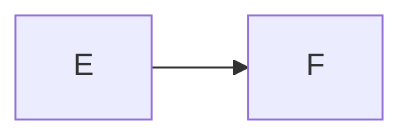
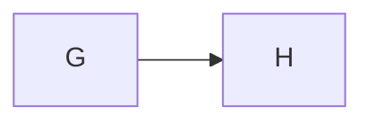
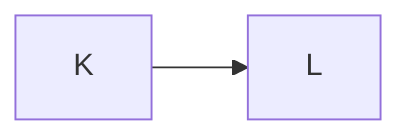

## B1: fig-cap + fig-alt, no label



## B2: label + fig-cap (crossref shape, mermaid comment prefix)



See @fig-diagram.

## B3: hash-prefix cell options in a mermaid fence

```mermaid
#| label: fig-hash
#| fig-cap: "Hash-prefixed."
flowchart LR
  I --> J
```

## B4: non-leading %%| comment stays a comment


