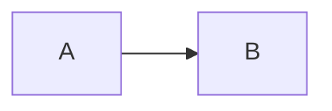
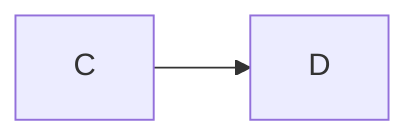

## Unknown option on a diagram cell


```mermaid
%%| fig-cap: A flowchart.
%%| echo: false
%%| theme: dark
flowchart LR
  A --> B
```

## Recognized but unroutable


```mermaid
%%| label: fig-d
%%| fig-cap: Long caption.
%%| fig-scap: Short.
flowchart LR
  C --> D
```

## Executable cell stays silent

```{python}
#| label: fig-p
#| fig-cap: A plot.
#| echo: false
#| warning: false
plot()
```
