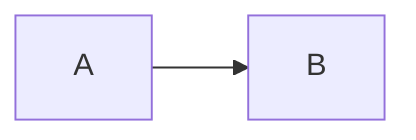
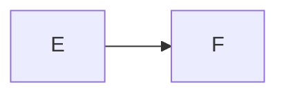

## A: GFM fence, no cell options — works today



## B: GFM fence with `%%|` cell options — options ignored



## C: brace cell, the Quarto 1 form — not recognized

```{mermaid}
%%| fig-cap: "A tiny flowchart."
%%| fig-alt: "Two nodes connected by an arrow."
flowchart LR
  C --> D
```
