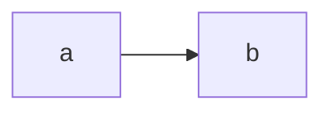

## Figures {#sec-figs}

{#fig-a}

See @fig-a, @tbl-t, and the unresolved @fig-nope.

## Tables

| a | b |
|---|---|
| 1 | 2 |

: A table caption {#tbl-t}

## Code

```python
print("hello")
```

Inline `code span` and a [link](https://example.com).

## Task list

- [ ] todo item
- [x] done item

## Footnote

Text with a footnote.[^1]

[^1]: The footnote body.

## Columns

::: {.columns}
:::: {.column width="50%"}
left column
::::
:::: {.column width="50%"}
right column
::::
:::

## Layout panel

::: {layout-ncol="2"}


:::

## Callout

::: {.callout-note}
A callout with code:

```r
x <- 1
```
:::

## Mermaid



## Raw details

<details><summary>More</summary>
Hidden content.
</details>

## Dark content

::: {.dark-content}
Only in dark mode.
:::
