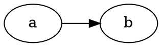
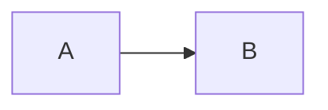
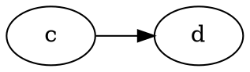
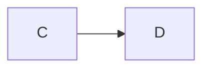

## Row

```dot
digraph G { rankdir=LR; a -> b }
```

```mermaid
flowchart LR
  A --> B
```

## Row

::: {.card title="C44-DOT"}

```dot
digraph G { rankdir=LR; c -> d }
```

:::

::: {.card title="C44-MERMAID"}

```mermaid
flowchart LR
  C --> D
```

:::
