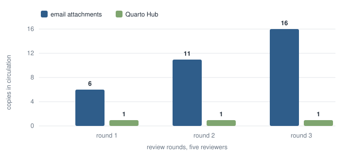

## Introduction

The usual way to review a document is to email it. Each reviewer gets an attachment, edits their copy, and sends it back; someone merges the copies by hand and mails the result out again. The local-first movement names what is lost here: work should live in a document you own *and* can edit together, without a merge step [@kleppmann2019]. Quarto Hub applies that idea to Quarto documents — one shared project, edited live, where prose and computation stay in a single source in the literate-programming tradition [@knuth1984].

This article is also a template. Each section shows one feature: citations here, an equation and a theorem in @sec-model, a figure and a table in @sec-results, and a review pass in @sec-discussion. Open the source beside the preview to see how each one is written.

## A simple model {#sec-model}

Suppose a draft goes to $n$ reviewers, each returns an edited copy, and the process repeats for $r$ rounds. Counting the original, the copies in circulation number

$$
c = 1 + nr
$$ {#eq-copies}

@eq-copies is linear and looks harmless. With five reviewers and three rounds it is sixteen files, every one named some variation of `draft-final-v3-REALLY-FINAL`, and a human has to merge them.

A shared document holds $c$ at one, and the reason can be stated precisely:

::: {#thm-one .theorem}
## One copy is enough
If every edit eventually reaches every replica, and applying the same set of edits yields the same state regardless of arrival order, then all replicas converge to one document.
:::

@thm-one is the convergence property of conflict-free replicated data types [@shapiro2011], the data structure underneath every Quarto Hub project. The merge in @eq-copies that someone had to do by hand happens continuously, keystroke by keystroke.

## Results {#sec-results}

@fig-copies plots @eq-copies for a five-reviewer team next to the shared-document alternative. The gap is the by-hand merge work.

{#fig-copies width="85%"}

@tbl-copies tabulates both curves, adding a three-reviewer team.

| Round | Email, 3 reviewers | Email, 5 reviewers | Quarto Hub |
|------:|-------------------:|-------------------:|-----------:|
|     1 |                  4 |                  6 |          1 |
|     2 |                  7 |                 11 |          1 |
|     3 |                 10 |                 16 |          1 |

: Copies in circulation after each round {#tbl-copies}

## Discussion {#sec-discussion}

Drafts are reviewed in the text. This paragraph is under review right now:

Merging copies by hand is [-- annoying][++ where edits get lost], and the merge step is [!! exactly what a shared document removes]. [>> Has anyone ever met a draft-final-v3-REALLY-FINAL they trusted?]

Marks: `[++ ]` insert, `[-- ]` delete, `[!! ]` highlight, `[>> ]` comment. They are suggestions, not tracked changes.

Convergence does not depend on the order edits arrive.[^1] What the count in @eq-copies really measures is not storage but attention: every extra copy is a place where a decision can silently diverge.

[^1]: The merge is commutative and associative, so two replicas can apply the same edits in different orders and still agree [@shapiro2011].

## Conclusion

Keep one copy. The arithmetic of @eq-copies never gets better with more reviewers or more rounds, and the merge work it hides lands on whoever mails out the next draft. A shared document makes $c = 1$ an invariant instead of an aspiration.

## Make it yours

For an initial walkthrough of Quarto Hub itself, start with the [getting started guide](https://quarto-dev.github.io/quarto-hub/get-started.html).

Fork this project {style="height:1em;vertical-align:middle"} from your project list. In your copy, change the title block at the top of this file: title, authors, date, abstract. Replace the entries under `references:` with your own and cite them with `@key`. Keep the `filters: [quarto, citeproc]` line; it turns the keys into formatted citations and builds the reference list. The references are listed in the front matter because Quarto Hub cannot yet read a separate bibliography file. With the Quarto 2 command line, a `references.json` file works as well.

Label figures with `#fig-`, tables with `#tbl-`, equations with `#eq-`, and sections with `#sec-`, then refer to them with `@`. Numbering updates automatically.

Quarto Hub previews HTML. With the Quarto 2 command line, the same source also renders to PDF or Word by adding `pdf` or `docx` under `format:`.

## References {.unnumbered}

::: {#refs}
:::
