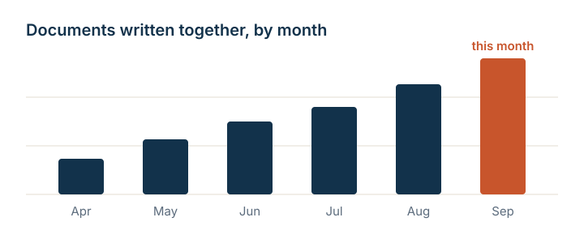

## Slides are headings

Every `##` heading starts a new slide. Everything under it, up to the next heading, belongs to that slide.

:::: {.columns}
::: {.column width="33%"}
::: {.card}
Write

One file, everyone at once.
:::
:::

::: {.column width="33%"}
::: {.card}
Preview

The slide redraws as you type.
:::
:::

::: {.column width="33%"}
::: {.card}
Present

Full screen, from the browser.
:::
:::
::::

## One idea per slide

::: {.statement}
Say one thing, then stop.[>> This!]
:::

Short lines read well from the back of the room. If a slide needs a second idea, it needs a second slide.

## Reveal one point at a time
<br>

::: {.incremental}
- Press the right arrow and the first point appears
- Press it again for the second
- And once more for the third
:::
<br>

Add `{.incremental}` to a list, or `{.fragment}` to any block, to step through it.

## Two columns

::: {.columns}

::: {.column width="50%"}

::: {.card}

Claim

Put the statement you want remembered on the left.

:::

:::

::: {.column width="50%"}

::: {.card}

Evidence

Put the chart, table, or quote that supports it on the right.

:::

:::

:::

## Part two: showing things {.center .divider}

Code, images, and quotes each get a slide of their own.

## Code

```python
def greet(name):
    return f"Hello, {name}"

print(greet("Quarto"))
```

Code blocks are highlighted by language. Keep them short enough to read from a distance.

## Images

{width="78%"}

Drop an image into the project and reference it by name. Set a width, or leave it off and the image fills the slide.

## A quote

> The best way to have a good idea is to have a lot of ideas.

[Linus Pauling]{.attribution}

## Presenting

Click a slide in the preview first, so the keys reach it.

:::: {.columns}
::: {.column width="33%"}
::: {.card}
Arrows

Next and previous slide.
:::
:::

::: {.column width="33%"}
::: {.card}
Esc

Every slide at once.
:::
:::

::: {.column width="33%"}
::: {.card}
F

Full screen on and off.
:::
:::
::::

## Make it yours {.center .divider}

Fork this deck {.icon} from your project list. In your copy, change the title and author at the top of this file and delete the slides you do not need. Fonts and colors live in `styles.scss`.

New to Quarto Hub? The [getting started guide](https://quarto-dev.github.io/quarto-hub/get-started.html) is a short walkthrough.
