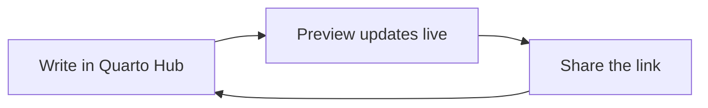

Each section below shows one thing a page can do. The source is short. Open this file in the editor and compare it with the preview.

## Callouts

::: {.callout-tip}
## Five kinds
Callouts come as note, tip, warning, caution, and important.
:::

::: {.callout-warning}
The preview follows the source as you type. Broken syntax shows an error right away, with the line number.
:::

## Tabs

Tabs can show the same thing two ways, such as the same step in R and Python.

::: {.panel-tabset}
## Python

```python
import pandas as pd
df = pd.read_csv("data.csv")
```

## R

```r
library(readr)
df <- read_csv("data.csv")
```
:::

## Tables with cross-references

Give a table a label that starts with `tbl-`, then refer to it as `@tbl-roles`. The number is filled in for you: @tbl-roles lists who does what.

| Role     | Person |
|----------|--------|
| Editor   | Name   |
| Reviewer | Name   |

: Roles on this site {#tbl-roles}

## Diagrams

Mermaid diagrams render in the preview on pages that set `format: q2-preview`, as this one does.



## Footnotes

Footnotes move to the bottom of the page.[^1] The number links both ways.

[^1]: Like this one.

## Code

Fenced code blocks are highlighted by language.

```javascript
const greeting = (name) => `Hello, ${name}`;
console.log(greeting("Quarto"));
```
