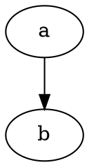
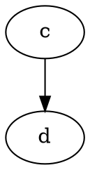
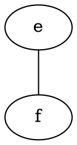

See @fig-flow.


```dot
//| label: fig-flow
//| fig-cap: A numbered float, aligned right.
//| fig-align: right
digraph G { a -> b }
```


```dot
//| fig-cap: An unnumbered figure.
digraph G { c -> d }
```


```dot
//| fig-align: left
//| graph-layout: neato
//| fig-alt: Two nodes joined by an edge.
graph G { e -- f }
```

```{.dot graph-layout="circo"}
graph G { g -- h -- i -- g }
```
