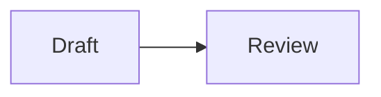

# `Q-2-48` — Wrong cell-option marker for a diagram cell

> `#|` is not a mermaid comment, so these lines are read as diagram
> source.

## What this means

Cell options are written in the cell language's **own comment syntax**.
Python and R comment with `#`, so their options are `#|`. Mermaid
comments with `%%`, so its options are `%%|`:

```` markdown

````

A block that starts with `#|` instead has no cell options at all —
Quarto sees ordinary diagram content:

```` markdown
```mermaid
#| fig-cap: The review cycle.
flowchart LR
  Draft --> Review
```
````

Because `#` means nothing to Mermaid either, those lines are handed to
the diagram renderer as part of the diagram, and Mermaid fails to parse
them. The result is a broken drawing with no caption — which is why
Quarto reports it here rather than letting the failure surface in the
browser console.

## Why this happens

Almost always familiarity with `#|` from Python and R cells. The marker
is not universal: it tracks the language, so `--|` serves Lua and SQL,
`//|` serves JavaScript and Rust, and `%%|` serves Mermaid.

Earlier Quarto 2 versions accepted `#|` inside a ```` ```mermaid ````
fence. That was a bug, and accepting it taught the wrong rule; Quarto 2
now matches Quarto 1 and takes `%%|` only.

## How to fix

Change the marker:

```` markdown

````

Nothing else needs to change — the option names and values are the
same.

## Related

- [`Q-2-47`](Q-2-47.qmd) — the marker is right but the option is one a
  diagram cell cannot act on.
- [Diagrams](../../guides/authoring/diagrams.qmd) — captions,
  cross-references and alt text on diagrams.
