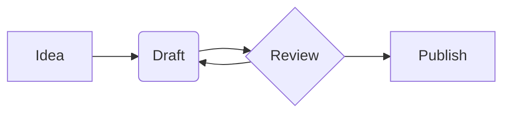
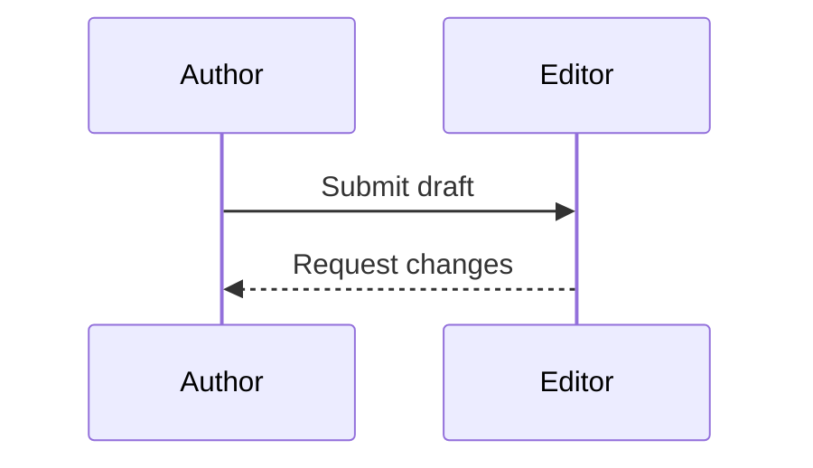
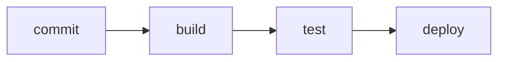
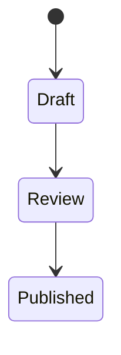

## Overview

Quarto renders [Mermaid](https://mermaid.js.org/) diagrams — flowcharts,
sequence diagrams, state machines, and the other chart types Mermaid
supports — from a plain-text description inside your document. To create
a diagram, write a fenced code block whose language is `mermaid`:

````markdown

````

This is the same syntax GitHub and GitLab render in their markdown
previews, so a diagram you wrote for a README works in a Quarto document
unchanged. Diagram blocks render in the `html` and `revealjs` formats,
and `q2 preview` draws them live as you edit.

@demo-mermaid-basic shows a complete document with two diagram types
alongside an ordinary code block:

:::: {#demo-mermaid-basic .embed-example-iframe file="/examples/diagrams/01-mermaid-basic/document.html"}
````markdown
---
title: "Mermaid diagrams"
---

A fenced code block marked `mermaid` renders as a diagram. A flowchart:


The same syntax draws every diagram type Mermaid supports. A sequence
diagram:


````

A flowchart and a sequence diagram, drawn from fenced `mermaid` blocks;
code blocks in other languages render as code. [View source](https://github.com/quarto-dev/q2/tree/main/examples/diagrams/01-mermaid-basic)
::::

To learn the diagram syntax itself — node shapes, arrow styles, and the
full catalog of diagram types — see the [Mermaid
documentation](https://mermaid.js.org/intro/).

## Diagrams in presentations

Slides accept the same fenced blocks: a `mermaid` block is ordinary
slide content, so any slide in a `format: revealjs` deck can carry a
diagram. @demo-mermaid-revealjs puts diagrams on two slides of a small
deck:

:::: {#demo-mermaid-revealjs .embed-example-iframe file="/examples/diagrams/02-mermaid-revealjs/slides.html"}
````markdown
---
title: "Diagrams in slides"
format: revealjs
---

## A release pipeline



## A state machine


````

Diagrams render on their slides at natural size — including slides that
are not visible when the deck first loads. [View source](https://github.com/quarto-dev/q2/tree/main/examples/diagrams/02-mermaid-revealjs)
::::

## How diagrams render

Quarto draws diagrams in the browser: the rendered page keeps your
diagram source and includes one script that loads the Mermaid library
from the [jsdelivr CDN](https://www.jsdelivr.com/) and converts every
diagram on the page to an SVG drawing. Two consequences are worth
knowing:

- **Viewing a page with diagrams requires network access.** Offline,
  the diagram source appears as preformatted text instead of a drawing.
- **Documents without diagrams are unaffected.** The library loads only
  on pages that contain at least one `mermaid` block.

If Mermaid cannot parse a diagram, the browser console reports the
error; `q2 preview` goes further and shows the error message, together
with the diagram source, in place of the drawing.

## Differences from Quarto 1

Quarto 1 embeds diagrams through executable cells — ```` ```{mermaid} ````
with `%%|` cell options — and Quarto 2 does not yet recognize that
form: only the plain ```` ```mermaid ```` fence renders. The following
Quarto 1 diagram features are also not yet available:

- Graphviz (`{dot}`) diagrams
- Figure captions, labels, and cross-references on diagrams
- Sizing options (`fig-width`, `fig-height`, `fig-responsive`)
- Pre-rendered PNG/SVG output for print formats (`mermaid-format`)
- Theming (Mermaid currently renders with its default theme regardless
  of the document theme)
