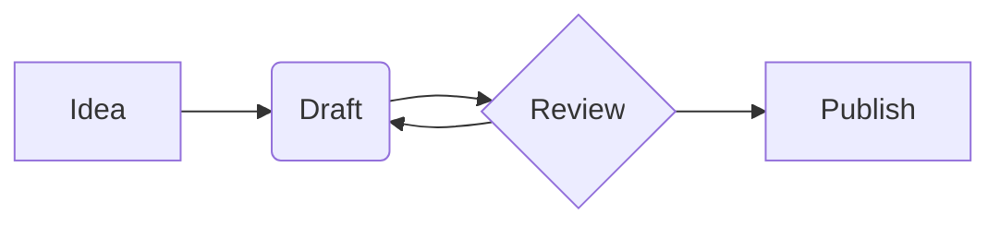
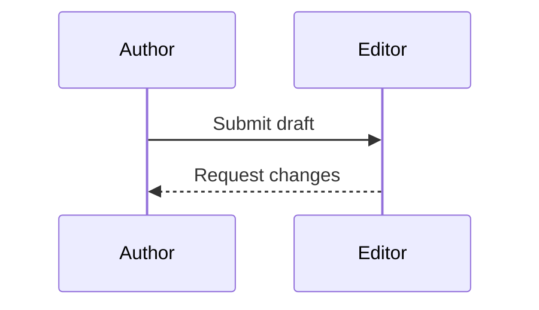
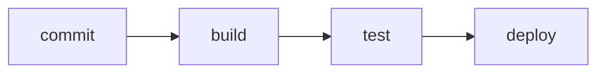
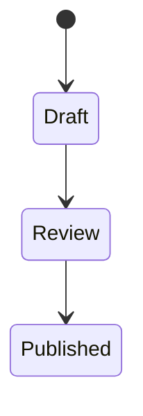
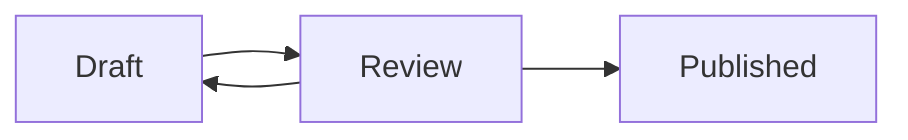

## Overview

Quarto renders [Mermaid](https://mermaid.js.org/) diagrams — flowcharts,
sequence diagrams, state machines, and the other chart types Mermaid
supports — from a plain-text description inside your document. To create
a diagram, write a fenced code block whose language is `mermaid`:

````markdown

````

This is the same syntax GitHub and GitLab render in their markdown
previews, so a diagram you wrote for a README works in a Quarto document
unchanged. Diagram blocks render in the `html` and `revealjs` formats,
and `q2 preview` draws them live as you edit.

@demo-mermaid-basic shows a complete document with two diagram types
alongside an ordinary code block:

:::: {#demo-mermaid-basic .embed-example-iframe file="/examples/diagrams/01-mermaid-basic/document.html"}
````markdown
---
title: "Mermaid diagrams"
---

A fenced code block marked `mermaid` renders as a diagram. A flowchart:


The same syntax draws every diagram type Mermaid supports. A sequence
diagram:


````

A flowchart and a sequence diagram, drawn from fenced `mermaid` blocks;
code blocks in other languages render as code. [View source](https://github.com/quarto-dev/q2/tree/main/examples/diagrams/01-mermaid-basic)
::::

To learn the diagram syntax itself — node shapes, arrow styles, and the
full catalog of diagram types — see the [Mermaid
documentation](https://mermaid.js.org/intro/).

## Diagrams in presentations

Slides accept the same fenced blocks: a `mermaid` block is ordinary
slide content, so any slide in a `format: revealjs` deck can carry a
diagram. @demo-mermaid-revealjs puts diagrams on two slides of a small
deck:

:::: {#demo-mermaid-revealjs .embed-example-iframe file="/examples/diagrams/02-mermaid-revealjs/slides.html"}
````markdown
---
title: "Diagrams in slides"
format: revealjs
---

## A release pipeline



## A state machine


````

Diagrams render on their slides at natural size — including slides that
are not visible when the deck first loads. [View source](https://github.com/quarto-dev/q2/tree/main/examples/diagrams/02-mermaid-revealjs)
::::

## Captions, cross-references, and alt text

A diagram can carry options, written at the top of the block, one per
line, after a `%%|` marker. The marker is Mermaid's own comment syntax —
each language uses its own, the way `#|` serves Python and R — so a
diagram with options is still valid Mermaid.

`fig-cap` gives the diagram a caption:

````markdown

````

Add a `label` beginning with `fig-` and the diagram becomes a numbered
figure you can cross-reference with `@fig-…`, exactly like any other
Quarto figure:

````markdown


@fig-review shows the loop a draft goes through.
````

`fig-alt` is the description assistive technology reads. Because a
diagram is drawn as an SVG rather than an image, the description is
carried into the diagram itself as Mermaid's `accDescr:` directive,
which becomes the drawing's accessible description. **A diagram that
conveys information the surrounding text does not should always have a
`fig-alt`** — the caption names the diagram, the alt text describes it.

@demo-mermaid-captions shows both forms in one document:

:::: {#demo-mermaid-captions .embed-example-iframe file="/examples/diagrams/03-mermaid-captions/document.html"}
````markdown
---
title: "Diagram captions and alt text"
---

A `fig-cap` gives the diagram a caption:


Add a `label` beginning with `fig-` and the diagram becomes numbered and
cross-referenceable. `fig-alt` supplies the description assistive
technology reads:


@fig-review shows the loop a draft goes through.
````

An uncaptioned diagram, a captioned one, and a numbered one that body
text refers to. [View source](https://github.com/quarto-dev/q2/tree/main/examples/diagrams/03-mermaid-captions)
::::

Diagram blocks accept `label`, `fig-cap`, `fig-scap`, and `fig-alt`. A
diagram has no execution engine to interpret anything else, so Quarto
warns about an option it cannot act on rather than passing it silently
into the drawing.

## How diagrams render

Quarto draws diagrams in the browser: the rendered page keeps your
diagram source and includes one script that loads the Mermaid library
and converts every diagram on the page to an SVG drawing.

The library is **written into your rendered output** and referenced by a
relative path — under `site_libs/mermaid/` in a website project, or
beside the page in a single-document render. Three consequences are
worth knowing:

- **Rendered output works without network access.** A site can be
  archived, or published on a closed or air-gapped network, and its
  diagrams still draw. Nothing is fetched from a third party when a
  reader opens the page.
- **Documents without diagrams are unaffected.** The library is written
  out and linked only for pages containing at least one `mermaid` block.
- **Every page shares one copy.** In a website project all diagram pages
  link the same file, which adds roughly 2.6 MB to the site once.

If Mermaid cannot parse a diagram, the browser console reports the
error; `q2 preview` goes further and shows the error message, together
with the diagram source, in place of the drawing.

::: {.callout-note}
## Preview still needs the network

The bundling described above applies to `q2 render`. During
`q2 preview`, diagrams are drawn by the preview's own copy of Mermaid,
which is still fetched from a CDN — so previewing a diagram offline may
show the diagram source instead of a drawing, even though rendering the
same document produces a self-contained page.
:::

## Differences from Quarto 1

Quarto 1 embeds diagrams through executable cells — ```` ```{mermaid} ````
— and Quarto 2 does not recognize that form: only the plain
fence ```` ```mermaid ```` renders. To move a Quarto 1 document over, drop
the braces; the diagram body and its `%%|` options need no other change.

The following Quarto 1 diagram features are not yet available:

- Graphviz (`{dot}`) diagrams
- Sizing options (`fig-width`, `fig-height`, `fig-responsive`)
- Pre-rendered PNG/SVG output for print formats (`mermaid-format`)
- Theming (Mermaid currently renders with its default theme regardless
  of the document theme)
