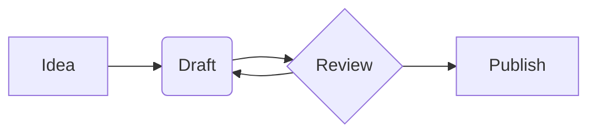
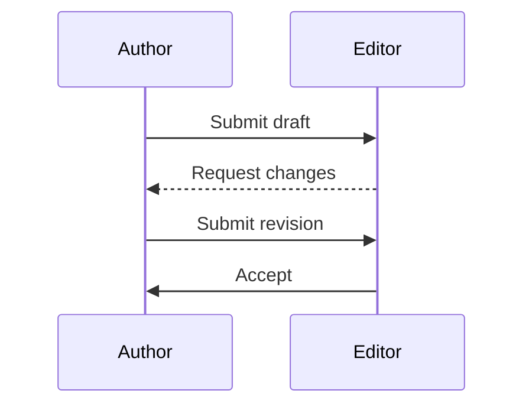

A fenced code block marked `mermaid` renders as a diagram. A flowchart:



The same syntax draws every diagram type Mermaid supports. A sequence
diagram:



Ordinary code blocks are unaffected:

```python
print("hello")
```
