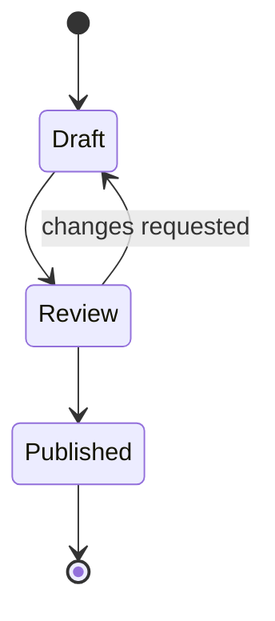

## A release pipeline

```mermaid
flowchart LR
  commit --> build
  build --> test
  test --> deploy
```

## Why it works

- The diagram block is ordinary slide content
- Each slide can carry its own diagram

## A state machine

```mermaid
stateDiagram-v2
  [*] --> Draft
  Draft --> Review
  Review --> Draft: changes requested
  Review --> Published
  Published --> [*]
```
