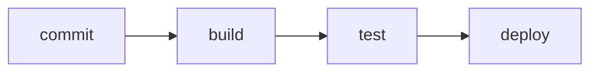
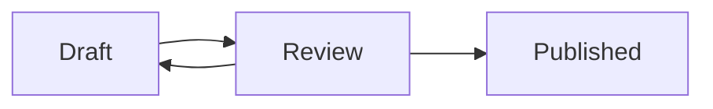

Diagram options are written at the top of the block, one per line, after
a `%%|` marker — `%%` is Mermaid's comment syntax, so each language uses
its own.

A `fig-cap` gives the diagram a caption:

Add a `label` beginning with `fig-` and the diagram becomes numbered and
cross-referenceable. `fig-alt` supplies the description assistive
technology reads:

@fig-review shows the loop a draft goes through.
