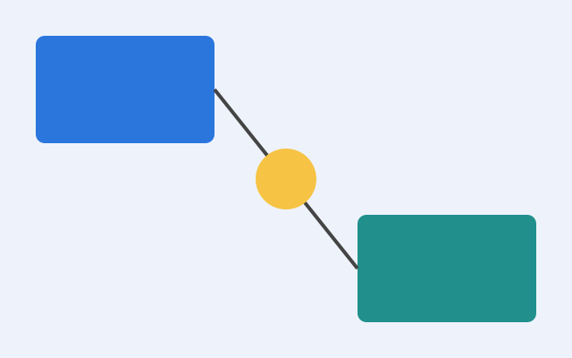

## A single image fills the slide

When a slide holds just one image, Quarto sizes it to fill the available space
so it never overflows. This happens by default.

## Keeping an image at its natural size

To opt out, set `auto-stretch: false` in the front matter (deck-wide), or give
the image an explicit `width`/`height`, or mark it `.nostretch`:

{.nostretch}
